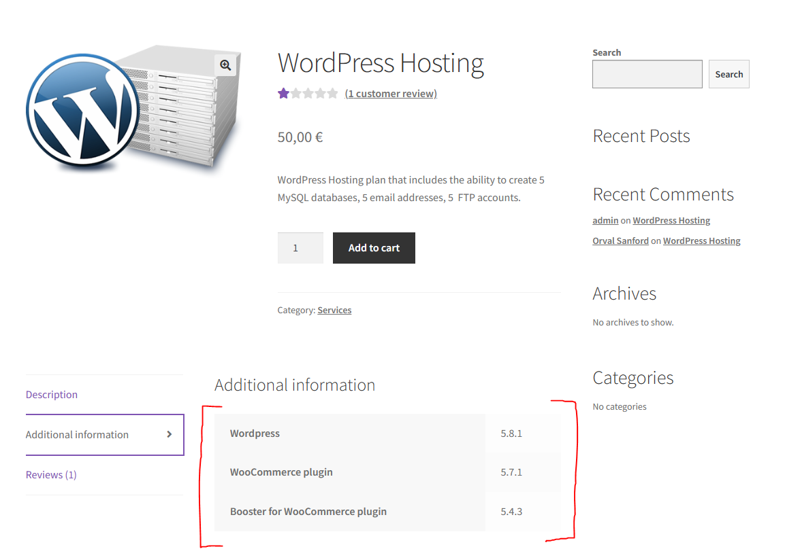
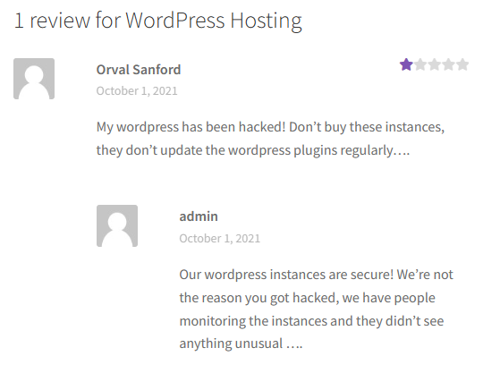
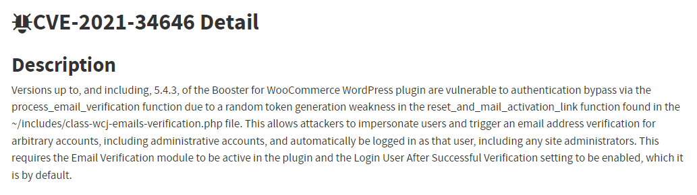
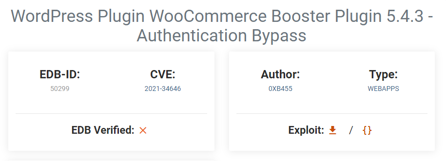

# Wordpress CVE

## 1\. Reconhecimento
Através da pesquisa geral no website, mais especificamente no produto "WordPress Hosting" disponível na loja, pudemos averiguar que a versão do WordPress é a 5.8.1 e que se encontram instalados os plugins WooComerce (v. 5.7.1) e Booster for WooCommerce (v. 5.4.3).



Ainda, através dos comentários recentes, também disponíveis na secção de avaliações daquele produto, recolhemos dois utilizadores do site: "Orval Sanford" e "admin". Tendo em conta o comentário do primeiro, deduz-se que os plugins do WordPress utilizados não são regularmente atualizados.  



## 2\. Pesquisa
Após a recolha da informação, realizamos uma pesquisa geral com o objetivo de encontrar vulnerabilidades já conhecidas que afetem as versões, tanto do WordPress como dos plugins associados. Tendo em conta a descoberta de nomes de utilizadores, faria sentido a procura de uma vulnerabilidade que nos permita fazer login como outro utilizador, preferencialmente com poder administrativo.

## 3\. Escolha da vulnerabilidade
Encontramos uma vulnerabilidade no plugin Booster for WooCommerce que afeta a versão 5.4.3 e anteriores, descrita na CVE-2021-34646, que permite aos atacantes fazerem-se passar por utilizadores e acionarem um pedido de verificação de email para contas arbitrárias, incluindo contas administrativas (admin), fazendo automaticamente o login como esse utilizador.



## 4\. Exploit
Após uma breve pesquisa no Exploit Database, encontramos um exploit para a referida CVE-2021-34646. Analisamos o seu funcionamento e usámo-lo contra o servidor do CTF. 



Funcionamento do exploit (descrito pelo autor):
```
# 1:
# Goto: https://target.com/wp-json/wp/v2/users/
# Pick a user-ID (e.g. 1 - usualy is the admin)
#
# 2:
# Attack with: ./exploit_CVE-2021-34646.py https://target.com/ 1
#
# 3:
# Check-Out  out which of the generated links allows you to access the system
```

## 5\. Vulnerabilidade
Através de um dos links gerados pelo exploit, foi-nos possivel ter acesso ao servidor com a conta de nome admin e, portanto, ter acesso a uma página privada de administração do WordPress onde encontramos um post privado que continha a flag procurada.
