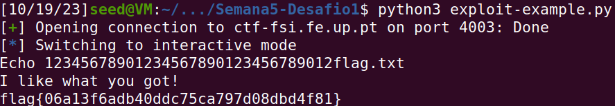

# Buffer-Overflow Attack Lab - Set-UID Version

## Tarefa 1 - Conhecer o _Shellcode_

Compilando e executando os programas conforme descrito no guião, verificamos que os dois programas lançam uma _shell_ no diretório onde foram compilados (uma de 32-bits e outra de 64).


## Tarefa 2 - Compreender o programa vulnerável

Correndo o comando ```make``` no diretório desejado, vemos que o programa em ```stack.c``` é compilado para diferentes versões (diferentes tamanhos do _buffer_ a partir do qual ocorrerá _buffer overflow_).


Analisando o código do programa, rapidamente identificamos a vulnerabilidade: na função ```bof()```, existe um _buffer_ com tamanho de 100 bytes, de acordo com ```BUF_SIZE```. Ora, aqui poderá ocorrer _buffer overflow_, uma vez que o _buffer_ receberá informação que poderá ter até 517 bytes, de acordo com o corpo da função ```main()```, uma vez que são lidos 517 bytes do ficheiro ```badfile```.

## Tarefa 3 - Ataque a programa de 32 bits (Nível 1)

Começa por se criar o ficheiro ```badfile```, usando ```touch badfile```.
Para descobrir o endereço de memória do _buffer_, bem como aquele em que se encontra o endereço de retorno da função ```bof()```, executamos o programa vulnerável em modo de _debug_, com o gdb (```gdb stack-L1-gdb```). Enviamos ```run```para começar a execução do programa, ```b bof``` para adicionar um _breakpoint_ na função ```bof()``` e ```next``` para avançar até ao ponto em que o registo ```ebp``` contém o endereço de retorno de ```bof()```.

Ficamos em condições de conhecer a posição de memória onde se encontra o _buffer_, bem como o conteúdo do registo ```ebp```:


De seguida, é necessário colocar o _shellcode_ a executar na posição correta de ```badfile```, uma vez que este ficheiro será aquele cujo conteúdo será escrito na _stack_. Para construir ```badfile``` à nossa medida, contamos com o _script_ ```exploit.py```.


Começamos por inserir o _shellcode_ pretendido, nas linhas 5 a 8, extraído do ficheiro ```call_shellcode.c```.

Nas linhas 16 e 17, inserimos o _shellcode_ no final da _payload_. Quando for inserido na _stack_, ficará nos endereços de memória mais altos do _buffer_.

Sabendo que o valor de ```ebp``` é ```0xffffca68```, o nosso objetivo é incrementálo para que passe a indicar o início do _shellcode_, tal como é feito na linha 21, construindo, assim, o endereço de retorno malicioso.

De seguida, na linha 22, é definido o _offset_ entre o início do buffer e o _ret_ malicioso.


Executámos o script de Python e o programa ```stack-L1``` e voilà! Temos uma _shell_ a correr nesse mesmo diretório.

## Tarefa 4 - Ataque a Programa de 32 bits sem conhecer o tamanho do _buffer_ (Nível 2)

O procedimento é semelhante ao do nível anterior, usando-se, na mesma, o _script_ ```exploit.py``` para criar ```badfile``` e levar a cabo o ataque. No entanto, apenas podemos usar o ```gdb``` para descobrir o endereço de início do ```buffer``` e não o de ```ebp```.

Usando, então, ```exploit.py```, que criará ```badfile```, começamos por colocar o _shellcode_ no fim da _payload_:

```python
...

16  start = 517 - len(shellcode)

...
```

Será importante fazer uso das intruções ```NOP```. Deste modo, o endereço de retorno malicioso que vamos introduzir na _payload_ levará a saltar para uma região de ```NOPs``` antecedentes ao _shellcode_, o que fará com que acabe por se saltar até ao _shellcode_, graças a essas instruções ```NOP```.

Usando o ```gdb``` da mesma forma que no nível anterior, descobrimos que o endereço de início do _buffer_ é ```0xffffc980```. Sabendo que a quantidade de bytes "seguros" para o programa (i.e. que não estão em _overflow_) é de até 200, interessa-nos que o valor do endereço de retorno seja alto o suficiente para cumprir aquilo que foi descrito no parágrafo anterior.

Assim, definimos ```ret```, com alguma margem:

```python
...
19  ret = 0xffffc980 + 400

...
```

Como não sabemos o tamanho concreto do _buffer_, a variável ```offset``` no _script_ python não tem relevância.

Por último, tendo em conta que não sabemos o valor de ```ebp```, vamos fazer _spraying_ do ```ret``` malicioso para que pelo menos um deles "calhe" no sítio "certo" (i.e. no _placeholder_ real para o endereço de retorno), que, por sua vez, apontará para a região de NOPs que antecede o _shellcode_, como descrito anteriormente.

Assim é feito o _spraying_ descrito:

```python
...

24  for i in range (50):
25      content[i*L : i*4 + L] = (ret).to_bytes(L, byteorder='little')

...
```

De novo, após executar o _script_ para produzir ```badfile```, corremos ```stack-L2``` e, mais uma vez, temos uma _shell_ priveligiada:


# CTF Buffer Overflow

## Ambiente de Desenvolvimento

Como pedido, foram instalados ```pwntools```e ```checksec```.

## Desafio 1

### ```checksec program```

Executando o comando ```checksec program``` no diretório do desafio, obtemos a informação abaixo:


De facto, tal como referido no enunciado do desafio, tomamos conhecimento de que ```program``` é de arquitetura ```i386-32-little```, não há RELRO, canário de proteção do endereço de retorno, nem aleatorização das posições do binário (PIE). Ainda, a pilha tem permissão de execução (```Stack:    Executable```) e existem regiões de memória com permissões de escrita, leitura e execução (RWX).

### Análise do código-fonte

Analisando o código fonte de ```program```, disponível no ficheiro ```main.c```, constatamos que o ficheiro cujo nome se encontra na variável ```meme_file``` é aberto e lido pelo programa:


Assim, o conteúdo de ```meme_file``` ditará o ficheiro aberto.

Tendo atenção às primeiras linhas do código, facilmente descobrimos um potencial _buffer overflow_:

```c
1   char meme_file[8] = "mem.txt\0";
2   char buffer[32];

...

11  scanf("%40s", &buffer);

...
```

A chamada a ```scanf``` permite ler do _input_ de utilizador até 40 caracteres. No entanto, estará a guardá-los em ```buffer```, que apenas "tem espaço" para 32. Aqui se encontra o potencial _buffer overflow_.

Ora, tendo em conta a ordem de declaração das variáveis ```meme_file``` e ```buffer``` e que a pilha cresce "para baixo" (isto é, para posições de memória de endereço inferior), esta terá, aquando da execução do programa, o seguinte aspeto:


Então, dos 40 caracteres que podem ser introduzidos, os 8 últimos, "a mais" para ```buffer```, serão escritos "por cima" de ```meme_file```.

### Ataque e obtenção de _flag_

Tendo em conta o descrito anteriormente, um ataque bem-sucedido é levado a cabo escrevendo, na fase de _input_ do utilizador, 32 caracteres arbitrários (que ocuparão as posições de ```buffer```) seguidos de ```flag.txt```, que ocupará a região de ```meme_file```, o que alterará o ficheiro cujo conteúdo será revelado.

Testando localmente:


E, finalmente, no servidor, após ajustar ```exploit-example.py``` à medida, revelando a _flag_:

```python
...

12   r.sendline(b"12345678901234567890123456789012flag.txt")

...
```



## Desafio 2

Começando por executar ```checksec program```, obtemos também:


À semelhança do desafio anterior, o código de ```program``` contém uma vulnerabilidade de _buffer overflow_ ao povoar a variável ```buffer```:

```c
...

5   char val[4] = "\xef\xbe\xad\xde";
6   char meme_file[9] = "mem.txt\0\0";
7   char buffer[32];

...

12  scanf("%45s", &buffer);

...
```

Apesar de ```buffer``` apenas ser de 32 bytes, a instrução da linha 12 permite ler _input_ de utilizador até 45 bytes. Assim, tal como no primeiro desafio, é possível, através desse _input_, povoar ```val``` e ```meme_file``` ao nosso jeito.

A particularidade do desafio reside no facto de ocorrer uma verificação do conteúdo de ```val```. No caso, o conteúdo do ficheiro cujo nome se encontra especificado em ```meme_file``` só será lido caso ```*(int*)val == 0xfefc2324```. Executando o programa pela primeira vez, constatamos que o valor predefinido para ```val``` se traduz para ```0xdeadbeef```:


Então, o valor a escrever em ```var``` que se traduzirá para o que queremos (```0xfefc2324```) será ```\x24\x23\xfc\xfe```.

Assim sendo, o ataque dar-se-á inserindo 45 caracteres que povem ```buffer``` de qualquer maneira, ```meme_file``` de ```flag.txt\0``` e ```val``` tal como foi descrito.

Tendo em conta a ordem de declaração das variáveis em ```program``` e o explicado no âmbito do desafio anterior em relação à pilha, procedemos ao ataque no servidor, introduzindo, através do _script_ ```exploit-example.py```, ```xxxxxxxxxxxxxxxxxxxxxxxxxxxxxxxxflag.txt\0\x24\x23\xfc\xfe```:

```python
...

12  r.sendline(b"xxxxxxxxxxxxxxxxxxxxxxxxxxxxxxxxflag.txt\0\x24\x23\xfc\xfe")

...
```

No entanto, o _output_ que recebemos denota que o conteúdo que foi inserido em ```val``` não tem a ver com o pretendido, nem com ```deadbeef```:


Ora, tal levou-nos a crer que a ordem de declaração das variáveis no servidor é diferente daquela que é usada no programa local. Assim, experimentamos com a ordem de ```mem_file``` e de ```val``` trocada; ou seja, com _input_ ```xxxxxxxxxxxxxxxxxxxxxxxxxxxxxxxx\x24\x23\xfx\feflag.txt\0```, o que resultou:


