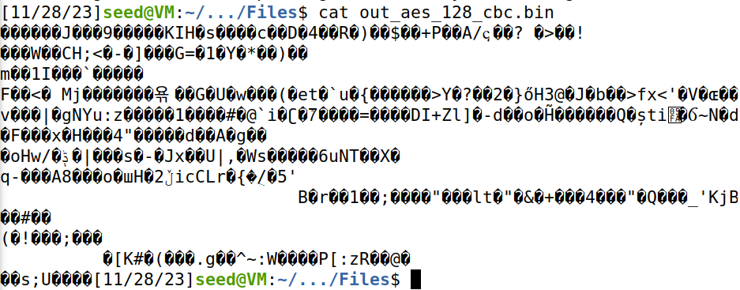
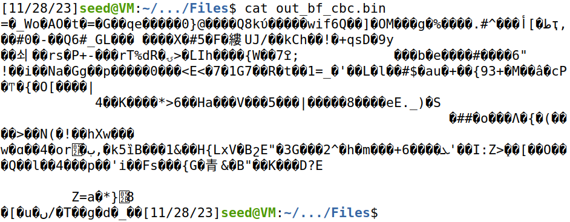
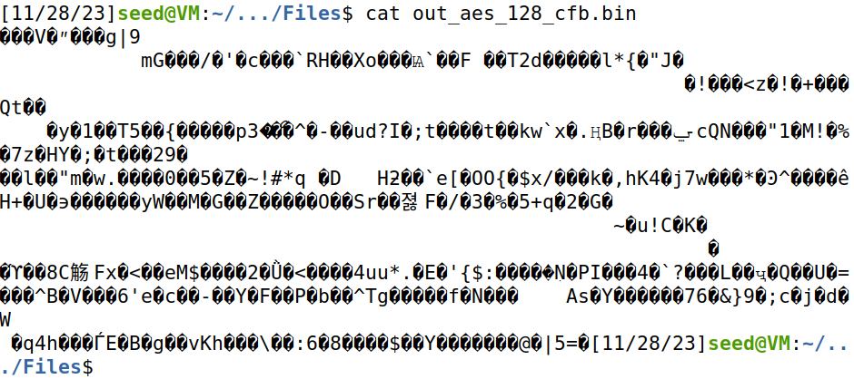
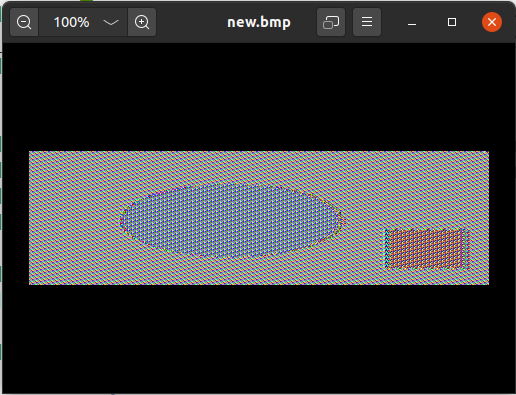
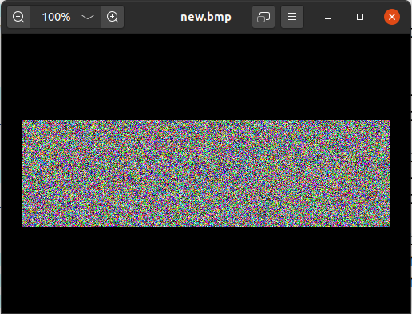
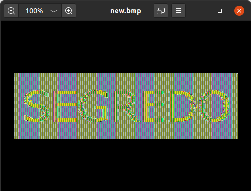
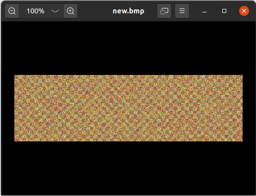
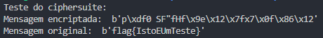
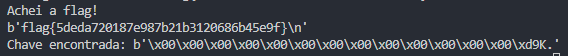

# Secret Key Encription Lab

## Ambiente do Lab

Tendo em conta que a configuração do contentor apenas é necessária para a tarefa 6.3, cujo desempenho não é esperado, o passo de configuração do ambiente do Lab foi saltado.

## Tarefa 1: Análise de Frequência

Começamos por substituir o ficheiro ```ciphertext.txt``` em ```Labsetup/Files``` pelo ```ciphertext.txt``` fornecido pelo nosso docente.

O primeiro passo é calcular as frequências dos n-gramas no texto encriptado. Para isso, bastou correr o _script_ ```freq.py``` já fornecido, que apresenta o _top_ 20 de 1-, 2- e 3-gramas no texto. Obtivemos a seguinte informação:

```
-------------------------------------
1-gram (top 20):
f: 578
v: 578
m: 525
x: 385
w: 299
g: 237
e: 235
y: 198
d: 192
i: 192
k: 188
b: 111
j: 110
l: 106
s: 80
r: 63
q: 52
h: 39
t: 38
o: 30
-------------------------------------
2-gram (top 20):
mx: 108
fx: 79
wf: 73
fg: 73
yv: 70
ym: 67
vw: 66
iv: 61
dv: 60
vx: 59
yf: 56
gi: 56
mw: 56
vg: 55
fw: 53
qd: 52
ve: 47
im: 47
wv: 46
vk: 45
-------------------------------------
3-gram (top 20):
qdv: 40
lmx: 30
vgi: 28
fgy: 26
fgi: 22
giv: 22
Qdv: 19
gym: 19
gim: 18
lvw: 16
ifg: 15
wfg: 15
fym: 14
fwf: 14
xfx: 13
gyv: 13
mxx: 13
vxi: 13
wfk: 12
mxf: 12
```

Começando por olhar para os unigramas, vemos que os caracteres mais frequentes são ```f``` e ```v```. Tendo em conta que os dois caracteres mais frequentes em textos em língua portuguesa são ```a``` e ```e```, é sensato pensar que ```f``` e ```v``` os mapeiam. Procedendo à substituição de todos os ```f``` e ```v``` por ```A``` e ```E```, respetivamente, e gravando o resultado em ```out.txt``` (```tr 'fv' 'AE' < ciphertext.txt > out.txt```), obtemos:

```
Ax AwkAx E mx hAwmEx AxxegAbAymx
QdE yA mjeyEgiAb swAeA LdxeiAgA
Pmw kAwEx gdgjA yE AgiEx gAlErAymx
PAxxAwAk AegyA AbEk yA TAswmhAgA
Ek sEwermx E rdEwwAx ExtmwjAymx
MAex ym qdE swmkEieA A tmwjA odkAgA
E EgiwE rEgiE wEkmiA EyetejAwAk
Nmlm REegm qdE iAgim xdhbekAwAk

...
```

_(Nota: optamos por subsituir sempre letras cifradas por letras maiúsculas, para facilitar a distinção entre caracteres cifrados e caracteres já decifrados.)_

Ainda parece cedo para decidir se a substituição foi ou não bem feita. Assim, prossegue-se com o terceiro unigrama, ```m```. Atendendo, mais uma vez, às frequências na língua portuguesa, substitui-se ```m``` por ```O``` (```tr 'fvm' 'AEO' < ciphertext.txt > out.txt```). Resultado:

```
Ax AwkAx E Ox hAwOEx AxxegAbAyOx
QdE yA OjeyEgiAb swAeA LdxeiAgA
POw kAwEx gdgjA yE AgiEx gAlErAyOx
PAxxAwAk AegyA AbEk yA TAswOhAgA
Ek sEwerOx E rdEwwAx ExtOwjAyOx
MAex yO qdE swOkEieA A tOwjA odkAgA
E EgiwE rEgiE wEkOiA EyetejAwAk
NOlO REegO qdE iAgiO xdhbekAwAk

...
```

Repetindo para o quarto unigrama: ```x``` -> ```S```:

```
AS AwkAS E OS hAwOES ASSegAbAyOS
QdE yA OjeyEgiAb swAeA LdSeiAgA
POw kAwES gdgjA yE AgiES gAlErAyOS
PASSAwAk AegyA AbEk yA TAswOhAgA
Ek sEwerOS E rdEwwAS EStOwjAyOS
MAeS yO qdE swOkEieA A tOwjA odkAgA
E EgiwE rEgiE wEkOiA EyetejAwAk
NOlO REegO qdE iAgiO SdhbekAwAk

...
```

Neste momento, já nos parece sensato avançar para uma próxima substituição sem olhar para as frequências, pois algumas porções parcialmente decifradas de palavras já sugerem o resto da palavra. Tentemos substituir ```y``` por ```D```:

```
AS AwkAS E OS hAwOES ASSegAbADOS
QdE DA OjeDEgiAb swAeA LdSeiAgA
POw kAwES gdgjA DE AgiES gAlErADOS
PASSAwAk AegDA AbEk DA TAswOhAgA
Ek sEwerOS E rdEwwAS EStOwjADOS
MAeS DO qdE swOkEieA A tOwjA odkAgA
E EgiwE rEgiE wEkOiA EDetejAwAk
NOlO REegO qdE iAgiO SdhbekAwAk

...
```

Olhemos agora para o trigrama mais frequente no texto cifrado: ```qdv```. Atendendo ao facto de que o trigrama mais frequente em textos em língua portuguesa é ```que``` e, além disso, já temos indícios de que ```v``` cifra a letra ```E```, apostamos na substituição de ```q``` por ```Q``` e de ```d``` por ```U```:

```
AS AwkAS E OS hAwOES ASSegAbADOS
QUE DA OjeDEgiAb swAeA LUSeiAgA
POw kAwES gUgjA DE AgiES gAlErADOS
PASSAwAk AegDA AbEk DA TAswOhAgA
Ek sEwerOS E rUEwwAS EStOwjADOS
MAeS DO QUE swOkEieA A tOwjA oUkAgA
E EgiwE rEgiE wEkOiA EDetejAwAk
NOlO REegO QUE iAgiO SUhbekAwAk

...
```

Percorrendo o texto obtido até então, encontramos algumas palavras parcialmente decifradas que parecem apontar para palavras conhecidas. Concretamente:

- ```DAQUEbES``` -> ```DAQUELES```
- ```QUEk``` -> ```QUEM```
- ```ESjUDO``` -> ```ESCUDO```
- ```POw``` -> ```POR```

Tentemos então a nossa sorte, substituindo ```b``` por ```L```, ```k``` por ```M```, ```j``` por ```C``` e ```w``` por ```R```:

```
AS ARMAS E OS hAROES ASSegALADOS
QUE DA OCeDEgiAL sRAeA LUSeiAgA
POR MARES gUgCA DE AgiES gAlErADOS
PASSARAM AegDA ALEM DA TAsROhAgA
EM sERerOS E rUERRAS EStORCADOS
MAeS DO QUE sROMEieA A tORCA oUMAgA
E EgiRE rEgiE REMOiA EDeteCARAM
NOlO REegO QUE iAgiO SUhLeMARAM

...
```

Parece que estamos no bom caminho. Aplicando, mais uma vez, o método baseado na semelhança a palavras da língua portuguesa, substituimos:

- ```h``` -> ```B```
- ```e``` -> ```I```
- ```g``` -> ```N```
- ```i``` -> ```T```
- ```l``` -> ```V```
- ```r``` -> ```G```
- ```t``` -> ```F```

E obtemos:

```
AS ARMAS E OS BAROES ASSINALADOS
QUE DA OCIDENTAL sRAIA LUSITANA
POR MARES NUNCA DE ANTES NAVEGADOS
PASSARAM AINDA ALEM DA TAsROBANA
EM sERIGOS E GUERRAS ESFORCADOS
MAIS DO QUE sROMETIA A FORCA oUMANA
E ENTRE GENTE REMOTA EDIFICARAM
NOVO REINO QUE TANTO SUBLIMARAM

...
```

Repetindo:

- ```s``` -> ```P```
- ```o``` -> ```H```
- ```c``` -> ```J```
- ```p``` -> ```Z```
- ```z``` -> ```X```

Finalmente, o resultado gravado em ```out.txt``` já nos faz todo o sentido, pelo que parece sensato acreditar que o texto está decifrado:

```
AS ARMAS E OS BAROES ASSINALADOS
QUE DA OCIDENTAL PRAIA LUSITANA
POR MARES NUNCA DE ANTES NAVEGADOS
PASSARAM AINDA ALEM DA TAPROBANA
EM PERIGOS E GUERRAS ESFORCADOS
MAIS DO QUE PROMETIA A FORCA HUMANA
E ENTRE GENTE REMOTA EDIFICARAM
NOVO REINO QUE TANTO SUBLIMARAM

E TAMBEM AS MEMORIAS GLORIOSAS
DAQUELES REIS QUE FORAM DILATANDO
A FE O IMPERIO E AS TERRAS VICIOSAS
DE AFRICA E DE ASIA ANDARAM DEVASTANDO
E AQUELES QUE POR OBRAS VALEROSAS
SE VAO DA LEI DA MORTE LIBERTANDO
CANTANDO ESPALHAREI POR TODA PARTE
SE A TANTO ME AJUDAR O ENGENHO E ARTE

CESSEM DO SABIO GREGO E DO TROIANO
AS NAVEGACOES GRANDES QUE FIZERAM
CALESE DE ALEXANDRO E DE TRAJANO
A FAMA DAS VITORIAS QUE TIVERAM
QUE EU CANTO O PEITO ILUSTRE LUSITANO
A QUEM NEPTUNO E MARTE OBEDECERAM
CESSE TUDO O QUE A MUSA ANTIGA CANTA
QUE OUTRO VALOR MAIS ALTO SE ALEVANTA

E VOS TAGIDES MINHAS POIS CRIADO
TENDES EM MIM UM NOVO ENGENHO ARDENTE
SE SEMPRE EM VERSO HUMILDE CELEBRADO
FOI DE MIM VOSSO RIO ALEGREMENTE
DAIME AGORA UM SOM ALTO E SUBLIMADO
UM ESTILO GRANDILOQUO E CORRENTE
PORQUE DE VOSSAS AGUAS FEBO ORDENE
QUE NAO TENHAM INVEJA AS DE HIPOCRENE

DAIME UMA FURIA GRANDE E SONOROSA
E NAO DE AGRESTE AVENA OU FRAUTA RUDA
MAS DE TUBA CANORA E BELICOSA
QUE O PEITO ACENDE E A COR AO GESTO MUDA
DAIME IGUAL CANTO AOS FEITOS DA FAMOSA
GENTE VOSSA QUE A MARTE TANTO AJUDA
QUE SE ESPALHE E SE CANTE NO UNIVERSO
SE TAO SUBLIME PRECO CABE EM VERSO

E VOS O BEM NASCIDA SEGURANCA
DA LUSITANA ANTIGA LIBERDADE
E NAO MENOS CERTISSIMA ESPERANCA
DE AUMENTO DA PEQUENA CRISTANDADE
VOS O NOVO TEMOR DA MAURA LANCA
MARAVILHA FATAL DA NOSSA IDADE
DADA AO MUNDO POR DEUS QUE TODO O MANDE
PARA DO MUNDO A DEUS DAR PARTE GRANDE

VOS TENRO E NOVO RAMO FLORESCENTE
DE UMA ARVORE DE CRISTO MAIS AMADA
QUE NENHUMA NASCIDA NO OCIDENTE
CESAREA OU CRISTIANISSIMA CHAMADA
VEDEO NO VOSSO ESCUDO QUE PRESENTE
VOS AMOSTRA A VITORIA JA PASSADA
NA QUAL VOS DEU POR ARMAS E DEIXOU
AS QUE ELE PARA SI NA CRUZ TOMOU

VOS PODEROSO REI CUJO ALTO IMPERIO
O SOL LOGO EM NASCENDO VE PRIMEIRO
VEO TAMBEM NO MEIO DO HEMISFERIO
E QUANDO DESCE O DEIXA DERRADEIRO
VOS QUE ESPERAMOS JUGO E VITUPERIO
DO TORPE ISMAELITA CAVALEIRO
DO TURCO ORIENTAL E DO GENTIO
QUE INDA BEBE O LICOR DO SANTO RIO

INCLINAI POR UM POUCO A MAJESTADE
QUE NESSE TENRO GESTO VOS CONTEMPLO
QUE JA SE MOSTRA QUAL NA INTEIRA IDADE
QUANDO SUBINDO IREIS AO ETERNO TEMPLO
OS OLHOS DA REAL BENIGNIDADE
PONDE NO CHAO VEREIS UM NOVO EXEMPLO
DE AMOR DOS PATRIOS FEITOS VALEROSOS
EM VERSOS DIVULGADO NUMEROSOS

VEREIS AMOR DA PATRIA NAO MOVIDO
DE PREMIO VIL MAS ALTO E QUASE ETERNO
QUE NAO E PREMIO VIL SER CONHECIDO
POR UM PREGAO DO NINHO MEU PATERNO
OUVI VEREIS O NOME ENGRANDECIDO
DAQUELES DE QUEM SOIS SENHOR SUPERNO
E JULGAREIS QUAL E MAIS EXCELENTE
SE SER DO MUNDO REI SE DE TAL GENTE
 
OUVI QUE NAO VEREIS COM VAS FACANHAS
FANTASTICAS FINGIDAS MENTIROSAS
LOUVAR OS VOSSOS COMO NAS ESTRANHAS
MUSAS DE ENGRANDECERSE DESEJOSAS
AS VERDADEIRAS VOSSAS SAO TAMANHAS
QUE EXCEDEM AS SONHADAS FABULOSAS
QUE EXCEDEM RODAMONTE E O VAO RUGEIRO
E ORLANDO INDA QUE FORA VERDADEIRO

POR ESTES VOS DAREI UM NUNO FERO
QUE FEZ AO REI O AO REINO TAL SERVICO
UM EGAS E UM D FUAS QUE DE HOMERO
A CITARA PARA ELES SO COBICO
POIS PELOS DOZE PARES DARVOS QUERO
OS DOZE DE INGLATERRA E O SEU MAGRICO
DOUVOS TAMBEM AQUELE ILUSTRE GAMA
QUE PARA SI DE ENEIAS TOMA A FAMA

POIS SE A TROCO DE CARLOS REI DE FRANCA
OU DE CESAR QUEREIS IGUAL MEMORIA
VEDE O PRIMEIRO AFONSO CUJA LANCA
ESCURA FAZ QUALQUER ESTRANHA GLORIA
E AQUELE QUE A SEU REINO A SEGURANCA
DEIXOU COM A GRANDE E PROSPERA VITORIA
OUTRO JOANE INVICTO CAVALEIRO
O QUARTO E QUINTO AFONSOS E O TERCEIRO

NEM DEIXARAO MEUS VERSOS ESQUECIDOS
AQUELES QUE NOS REINOS LA DA AURORA
FIZERAM SO POR ARMAS TAO SUBIDOS
VOSSA BANDEIRA SEMPRE VENCEDORA
UM PACHECO FORTISSIMO E OS TEMIDOS
ALMEIDAS POR QUEM SEMPRE O TEJO CHORA
ALBUQUERQUE TERRIBIL CASTRO FORTE
E OUTROS EM QUEM PODER NAO TEVE A MORTE

E ENQUANTO EU ESTES CANTO E A VOS NAO POSSO
SUBLIME REI QUE NAO ME ATREVO A TANTO
TOMAI AS REDEAS VOS DO REINO VOSSO
DAREIS MATERIA A NUNCA OUVIDO CANTO
COMECEM A SENTIR O PESO GROSSO
QUE PELO MUNDO TODO FACA ESPANTO
DE EXERCITOS E FEITOS SINGULARES
DE AFRICA AS TERRAS E DO ORIENTE OS MARES

EM VOS OS OLHOS TEM O MOURO FRIO
EM QUEM VE SEU EXICIO AFIGURADO
SO COM VOS VER O BARBARO GENTIO
MOSTRA O PESCOCO AO JUGO JA INCLINADO
TETIS TODO O CERULEO SENHORIO
TEM PARA VOS POR DOTE APARELHADO
QUE AFEICOADA AO GESTO BELO E TENRO
DESEJA DE COMPRARVOS PARA GENRO

EM VOS SE VEM DA OLIMPICA MORADA
DOS DOIS AVOS AS ALMAS CA FAMOSAS
UMA NA PAZ ANGELICA DOURADA
OUTRA PELAS BATALHAS SANGUINOSAS
EM VOS ESPERAM VERSE RENOVADA
SUA MEMORIA E OBRAS VALEROSAS
E LA VOS TEM LUGAR NO FIM DA IDADE
NO TEMPLO DA SUPREMA ETERNIDADE

MAS ENQUANTO ESTE TEMPO PASSA LENTO
DE REGERDES OS POVOS QUE O DESEJAM
DAI VOS FAVOR AO NOVO ATREVIMENTO
PARA QUE ESTES MEUS VERSOS VOSSOS SEJAM
E VEREIS IR CORTANDO O SALSO ARGENTO
OS VOSSOS ARGONAUTAS POR QUE VEJAM
QUE SAO VISTOS DE VOS NO MAR IRADO
E COSTUMAIVOS JA A SER INVOCADO

JA NO LARGO OCEANO NAVEGAVAM
AS INQUIETAS ONDAS APARTANDO
OS VENTOS BRANDAMENTE RESPIRAVAM
DAS NAUS AS VELAS CONCAVAS INCHANDO
DA BRANCA ESCUMA OS MARES SE MOSTRAVAM
COBERTOS ONDE AS PROAS VAO CORTANDO
AS MARITIMAS AGUAS CONSAGRADAS
QUE DO GADO DE PROTEU SAO CORTADAS

QUANDO OS DEUSES NO OLIMPO LUMINOSO
ONDE O GOVERNO ESTA DA HUMANA GENTE
SE AJUNTAM EM CONCILIO GLORIOSO
SOBRE AS COUSAS FUTURAS DO ORIENTE
PISANDO O CRISTALINO CEU FORMOSO
VEM PELA VIALACTEA JUNTAMENTE
CONVOCADOS DA PARTE DO TONANTE
PELO NETO GENTIL DO VELHO ATLANTE
```

Na tabela abaixo encontra-se um apanhado das substituições efetuadas:

| No texto cifrado | No resultado |
| ---------------- | ------------ |
| f | A |
| v | E |
| m | O |
| x | S |
| y | D |
| q | Q |
| d | U |
| b | L |
| k | M |
| j | C |
| w | R |
| h | B |
| e | I |
| g | N |
| i | T |
| l | V |
| r | G |
| t | F |
| s | P |
| o | H |
| c | J |
| p | Z |
| z | X |

## Tarefa 2: Encriptação com Diferentes Cifras e Modos

Definamos o texto a encriptar, uma canção popular basca chamada _Ikusi Mendizaleak_, no ficheiro ```plain.txt```:

```
Ikusi mendizaleak
Baso eta zelaiak
Mendi tontor gainera
Igo bsegredoar dugu

Ez nekeak, ez da bide txarra
Gora, gora, neska-mutilak, ah ah ah
Gu euskaldunak gara
Euskal herrikoak

Ez nekeak, ez da bide txarra
Gora, gora, neska-mutilak, ah ah ah
Gu euskaldunak gara
Euskal herrikoak

Hemen mendi tontorrean
Euskal lurren artean
Begiak zabaldurik
Bihotza erretan

Hain ederra, hain polita da ta
Gora, gora Euskal Herria, ah ah ah
Gu euskaldunal gara
Euskal herrikoak

Ez nekeak, ez da bide txarra
Gora, gora Euskal Herria, ah ah ah
Gu euskaldunak gara
Euskal herrikoak

Gu euskaldunak gara
Euskal herrikoak
```

### AES-128-CBC

Começamos por uma encriptação por cifra ```aes-128-cbc```:

```shell
$ openssl enc -aes-128-cbc -e -in plain.txt -out out_aes_128_cbc.bin -K 00112233445566778889aabbccddeeff -iv 0102030405060708
```

Como seria de esperar, o _output_ é ininteligível:



Podemos verificar o processo inverso, a desencrpitação para um ficheiro ```dec_aes_128_cbc.txt```, com:

```shell
$ openssl enc -aes-128-cbc -d -in out_aes_128_cbc.bin -out dec_aes_128_cbc.txt -K 00112233445566778889aabbccddeeff -iv 0102030405060708
```

Correndo ```cat dec_aes_128_cbc.txt```, vemos que a mensagem resultante da desencriptação corresponde ao texto inicial.

### BF-CBC

Passemos a encriptação por cifra ```bf-cbc```:

```shell
$ openssl enc -bf-cbc -e -in plain.txt -out out_bf_cbc.bin -K 00112233445566778889aabbccddeeff -iv 0102030405060708
```

Como seria de esperar, o _output_ é ininteligível:



Podemos verificar o processo inverso, a desencrpitação para um ficheiro ```dec_bf_cbc.txt```, com:

```shell
$ openssl enc -bf-cbc -d -in out_bf_cbc.bin -out dec_bf_cbc.txt -K 00112233445566778889aabbccddeeff -iv 0102030405060708
```

Correndo ```cat dec_bf_cbc.txt```, vemos que a mensagem resultante da desencriptação corresponde ao texto inicial.

### AES-128-CFB

Por último, usamos a cifra ```aes-128-cfb```:

```shell
$ openssl enc -aes-128-cfb -e -in plain.txt -out out_aes_128_cfb.bin -K 00112233445566778889aabbccddeeff -iv 0102030405060708
```

Como seria de esperar, o _output_ é ininteligível:



Podemos verificar o processo inverso, a desencrpitação para um ficheiro ```dec_aes_128_cfb.txt```, com:

```shell
$ openssl enc -aes-128-cfb -d -in out_aes_128_cfb.bin -out dec_aes_128_cfb.txt -K 00112233445566778889aabbccddeeff -iv 0102030405060708
```

Correndo ```cat dec_aes_128_cfb.txt```, vemos que a mensagem resultante da desencriptação corresponde ao texto inicial.

## Tarefa 3 - Modo de Encriptação: ECB vs CBC

_(Nota: apesar de as imagens utilizadas no desenvolvimento da tarefa estarem em formato_ ```bmp```_, usamos o formato_ ```jpg``` _no repositório por questões de economia de espaço e de compatibilidade.)_

### Imagem Fornecida

É-nos fornecida a seguinte imagem, no ficheiro ```pic_original.bmp```:


#### Modo ECB

Começamos por encriptar ```pic_original.bmp``` para ```pic_enc_ecb.bmp```, usando a cifra AES-128-ECB:

```shell
$ openssl enc -aes-128-ecb -e -in pic_original.bmp -out pic_enc_ecb.bmp -K 00112233445566778889aabbccddeeff
```
_(Nota: omitimos o parâmetro_ ```-iv``` _pois, ao corrermos o comando com o mesmo especificado, recebemos o aviso de que não é usado na cifra escolhida.)_

O que se segue é ir construir um ficheiro com o conteúdo encriptado proveniente da imagem original, mas com um _header_ que possa ser interpretado como tal pelo programa de visualização de imagens. Obtemos esse cabeçalho do ficheiro original desencriptado, gravando-o num ficheiro auxiliar ```header```:

```shell
$ head -c 54 pic_original.bmp > header
```

De seguida, obtemos o conteúdo da imagem propriamente dito encriptado e gravamo-lo num ficheiro ```body```:

```shell
$ tail -c +55 pic_enc_ecb.bmp > body
```

Juntamos, então, ```header``` e ```body``` em ```new.bmp```:

```shell
$ cat header body > new.bmp
```

Abrindo o ficheiro recém-criado com o programa de visualização de imagens sugerido (```eog new.bmp```), visualizamos:



Ora, apesar de as cores apresentadas serem distintas das originais, podemos identificar claramente as formas geométricas da imagem original!

#### Modo CBC

Passemos agora a testar o comportamento do modo CBC, recorrendo à cifra AES-128-CBC.

Como de costume, encriptamos o ficheiro original:

```shell
$ openssl enc -aes-128-cbc -e -in pic_original.bmp -out pic_enc_cbc.bmp -K 00112233445566778889aabbccddeeff -iv 0102030405060708
```

_(Desta vez, já necessitamos do parâmetro_ ```-iv``` _.)_

Mais uma vez, construimos ```new.bmp``` com o cabeçalho original e o conteúdo encriptado:

```shell
$ head -c 54 pic_original.bmp > header
$ tail -c +55 pic_enc_cbc.bmp > body
$ cat header body > new.bmp
```

Abrimos, então, o resultado:



Desta vez, podemos ver que obtivemos algo completamente ininteligível, não sendo revelada, aparentemente, qualquer informação da imagem original.

### Imagem Escolhida

Repetimos a experiência com uma imagem à escolha. No caso, utilizamos uma imagem que contém um segredo:


#### Modo ECB

Encriptamos ```segredo.bmp``` para ```segredo_enc_ecb.bmp```, através da cifra AES-128-ECB:

```shell
$ openssl enc -aes-128-ecb -e -in segredo.bmp -out segredo_enc_ecb.bmp -K 00112233445566778889aabbccddeeff
```

Construimos ```new.bmp``` com o cabeçalho original e o conteúdo encriptado:

```shell
$ head -c 54 segredo.bmp > header
$ tail -c +55 segredo_enc_ecb.bmp > body
$ cat header body > new.bmp
```

Como seria de esperar, dado o uso do modo ECB, o resultado em ```new.bmp``` é revelador:



#### Modo CBC

Por último, recorremos à cifra AES-128-CBC.

Encriptamos o ficheiro original:

```shell
$ openssl enc -aes-128-cbc -e -in segredo.bmp -out segredo_enc_cbc.bmp -K 00112233445566778889aabbccddeeff -iv 0102030405060708
```

Construimos ```new.bmp``` com o cabeçalho original e o conteúdo encriptado:

```shell
$ head -c 54 segredo.bmp > header
$ tail -c +55 segredo_enc_cbc.bmp > body
$ cat header body > new.bmp
```

De novo, o resultado:



Ininteligível, como esperado.

### Conclusão

Podemos, assim, concluir que o modo de encriptação _Electronic Code Book_ não esconde os padrões na mensagem inicial, tornando possível, no caso de imagens, o reconhecimento dos mesmos no conteúdo encriptado. O modo _Cipher Block Chaining_, por sua vez, colmata o problema descrito.


# CTF Weak Randomness

## Analise do código que implementa o  esquema de cifra de bloco AES-CTR, no ficheiro cipherspec.py.

No ficheiro cipherspec.py, encontramos três funções: a função gen(), que gera uma chave aleatória, a função enc(), que encripta o texto, e a função dec(), que desencripta o texto.

A função gen() cria uma chave aleatória de 16 bytes. Esta chave é utilizada tanto para encriptar como para desencriptar o texto.

```py

KEYLEN = 16

def gen(): 
	offset = 3 # Hotfix to make Crypto blazing fast!!
	key = bytearray(b'\x00'*(KEYLEN-offset)) 
	key.extend(os.urandom(offset))
	return bytes(key)
```

OO programa gera uma chave aleatória usando a função gen(), a qual consiste numa parte preenchida com zeros e noutra parte preenchida com bytes aleatórios gerados pelo os.urandom(). Ao analisar mais detalhadamente a função gen(), podemos concluir que a chave apenas altera os últimos 3 bytes. Os primeiros 13 bytes são sempre iguais, o que significa que a chave está contida num espaço de 256^3 chaves possíveis (começa em 0 e vai até 256^3).

A função enc(k, m, nonce) encripta uma mensagem m utilizando a chave k e o nonce fornecido.

```py
def enc(k, m, nonce):
	cipher = Cipher(algorithms.AES(k), modes.CTR(nonce))
	encryptor = cipher.encryptor()
	cph = b""
	cph += encryptor.update(m)
	cph += encryptor.finalize()
	return cph
```

Enquanto a função dec(k, c, nonce) desencripta uma mensagem c utilizando a chave k e o nonce.

```py
def dec(k, c, nonce):
	cipher = Cipher(algorithms.AES(k), modes.CTR(nonce))
	decryptor = cipher.decryptor()
	msg = b""
	msg += decryptor.update(c)
	msg += decryptor.finalize()
	return msg
```

## Como consigo usar esta ciphersuite para cifrar e decifrar dados?

Para responder a esta pergunta, podemos testar a ciphersuite utilizando o código abaixo.

```py
print("Teste do ciphersuite:")
chave = gen()
mensagem = b"flag{IstoEUmTeste}"
nonce = os.urandom(KEYLEN)
cifra = enc(chave, mensagem, nonce)
print("Mensagem encriptada: ",cifra)
mensagemDecifrada = dec(chave, cifra, nonce)
print("Mensagem original: ", mensagemDecifrada)
```

O código acima gera uma chave aleatória, uma mensagem de teste e um nonce gerado aleatoriamente com o os.urandom(), com a dimensão do KEYLEN, que neste caso é 16. Em seguida, utilizamos a função enc() para encriptar a mensagem e imprimimos a mensagem encriptada. Depois, utilizamos a função dec() para desencriptar a mensagem e imprimimos a mensagem desencriptada.



## Como consigo fazer uso da vulnerabilidade que observei para quebrar o código?

A vulnerabilidade parece estar na geração da chave. O código utiliza parte da chave como zeros, o que pode tornar o sistema mais fraco. O uso do os.urandom() para a outra parte é mais seguro, mas o esquema como um todo pode ser vulnerável a ataques conhecidos como "related-key attacks" se a chave não for gerada adequadamente. Assim, como mencionado anteriormente, podemos concluir que a chave está contida num espaço de 256^3 chaves possíveis (começa em 0 e vai até 256^3). Podemos então testar todas as chaves possíveis usando brute force e verificar se alguma delas nos dá a flag.

## Como consigo automatizar este processo, para que o meu ataque saiba que encontrou a flag?

Como mencionado anteriormente, podemos usar brute force para testar todas as chaves possíveis e verificar se alguma delas nos dá a flag. Para este passo, podemos utilizar o nonce e o ciphertext fornecidos no servidor 'nc ctf-fsi.fe.up.pt 6003' e automatizar o processo de obter a flag. Para isso, podemos usar o código abaixo.

```py
print("Nonce e Ciphertext fornecidos pelo servidor:")
target_nonce = bytes.fromhex("c2ab473f3ddfc1e18c6a77e698ba8f10")
target_ciphertext = bytes.fromhex("b97cec47771d97ad30810aa9ab71cbe0e312d2ac02f1bdc1471ec82a856b3377a290a3c12a1fd1")

print("Mensagem cifrada:", target_ciphertext)
print("Nonce:", target_nonce)

boolFlag = False
chave_encontrada = None

for i in range(256**3):  # Testar todas as possíveis chaves
    chaveCTF = i.to_bytes(KEYLEN, byteorder='big')

    mensagemCTFDecifrada = dec(chaveCTF, target_ciphertext, target_nonce)

    #print("Chave:", chaveCTF)
    #print("Mensagem decifrada:", mensagemCTFDecifrada)

    if b"flag{" in mensagemCTFDecifrada or b'flag{' in mensagemCTFDecifrada:
        print("Achei a flag!")
        print(mensagemCTFDecifrada)
        chave_encontrada = chaveCTF
        boolFlag = True
        break

if boolFlag:
    print("Chave encontrada:", chave_encontrada)
else:
    print("Não encontrei a flag :(")
```

O código acima testa todas as chaves possíveis e verifica se alguma delas nos dá a flag. Se alguma chave nos der a flag, o código para e imprime a chave encontrada. Se nenhuma chave nos der a flag, o código para e imprime que não encontrou a flag. Esta abordagem é lenta, pois temos que testar todas as chaves possíveis, mas é a única forma de obter a flag. Como alternativa, poderíamos usar um loop infinito (while true) e a função gen() para gerar chaves aleatórias até encontrar a flag. No entanto, isso poderia demorar muito tempo ou até nunca encontrar a flag, pois a chave é gerada de forma aleatória. Mesmo usando um conjunto para armazenar as chaves já testadas, não há garantia de que a chave gerada não seja uma chave já testada, o que poderia prolongar indefinidamente o processo. Portanto, a abordagem de testar todas as chaves possíveis é a melhor, mesmo que por sorte a flag seja encontrada logo nas primeiras chaves testadas com a função gen().

