# Public Key Infrastructures Lab

## Configuração do Ambiente

Como descrito no guião, iremos utilizar um _container_ para dar _host_ ao servidor web, portanto, numa fase inicial, conseguimos utilizar o Docker através do comando ```dcbuild``` e iniciar o container com o comando ```dcup```.
Seguidamente, noutro terminal, executámos os comandos ```dockps``` para identificar os IDs dos containers e ```docksh``` juntamente com o ID do container para aceder a uma shell dentro do mesmo.

## Tarefa 1: Tornarmo-nos uma Autoridade de Certificação

Começamos por criar uma cópia do ficheiro de configuração _default_ presente em ```/usr/lib/ssl/openssl.cnf``` e colocá-lo no diretório de trabalho atual.
Como pedido no guião, no novo ficheiro alteramos a linha ```dir = ./CA```, descomentamos a linha ```unique_subject = no``` e preparamos o resto do ambiente criando os sub-diretórios e ficheiros necessários correndo os seguintes comandos:

```shell
mkdir CA && cd ./CA
mkdir certs
mkdir crl
mkdir newcerts
touch index.txt
echo "1000" >> serial
```

Para gerarmos o certificado _self-signed_ para a nossa Autoridade de Certificação corremos o seguinte comando:

```shell
openssl req -x509 -newkey rsa:4096 -sha256 -days 3650 -keyout ca.key -out ca.crt
```

Preenchemos as informaçoes pedidas com os seguintes valores:

```
PEM pass phrase: qwerty
Country name: PT
State or Province Name: Porto
Locality Name: Paranhos
Organization Name: UP
Organizational Unit Name: FEUP
Common Name: l05g02
Email Address: up2021XXXXX@fe.up.pt
```

Para verificar o contéudo descodificado dos dois ficheiros, o certificado X509 e a RSA key (```ca.crt``` e ```ca.key```, respetivamente) que armazenam o _output_ do commando anterior corremos os seguintes comandos:

```shell
openssl x509 -in ca.crt -text -noout
openssl rsa -in ca.key -text -noout
```

Após uma análise dos dois ficheiros  e ) conseguimos: - confirmar através da linha 59 do ficheiro ```ca.crt```, (```CA: TRUE```), que o certificado que criamos é um certificado de Autoridade de Certificação;
- confirmar através das linhas 7 e 11 do ficheiro ```ca.crt```, que o certificado que criamos é _self-signed_ uma vez que os valores nos campos ```Issuer``` e ```Subject``` são idênticos;
- identificar os valores dos elementos pedidos no guião:

```
expoente publico e: campo publicExponent do ficheiro ca.key
expoente privado d: campo privateExponent do ficheiro ca.key
modulus n: campo modulus de ambos os ficheiros
números secretos p e q: campos prime1 e prime2 do ficheiro ca.key
```

## Tarefa 2: Gerar um _Certificate Request_ para o nosso servidor web

Começamos por correr o seguinte comando para gerar o _Certificate Signing Request_ (CSR):

```shell
openssl req -newkey rsa:2048 -sha256 \
-keyout server.key -out server.csr \
-subj "/CN=www.bank32.com/O=Bank32 Inc./C=US" \
-passout pass:qwerty \
-addext "subjectAltName = DNS:www.bank32.com, DNS:www.bank32A.com, DNS:www.bank32B.com"
```

Seguidamente corremos os comandos para verificar o contéudo descodificado dos dois ficheiros, o CSR e a _private key_ ( e ), respetivamente):

```shell
openssl req -in server.key -text -noout
openssl rsa -in server.csr -text -noout
```

## Tarefa 3: Gerar um certificado para o nosso servidor 

Primeiramente descomentamos a linha ```copy_extensions = copy``` no ficheiro ```openssl.cnf``` e corremos o seguinte comando para gerar o certificado para o nosso servidor:

```shell
openssl ca -config openssl.cnf -policy policy_anything \
-md sha256 -days 3650 \
-in server.csr -out server.crt -batch \
-cert ca.crt -keyfile ca.key
```

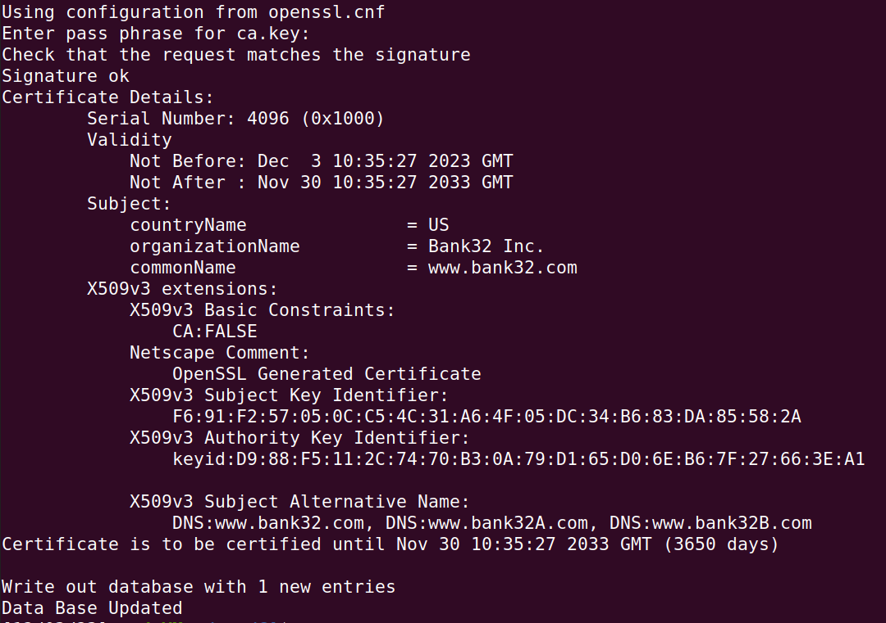

Como podemos verificar na seguinte secção do ficheiro, os nomes alternativos adicionados na tarefa 2 estao presentes no certificado.

```bash
X509v3 Subject Alternative Name: 
                DNS:www.bank32.com, DNS:www.bank32A.com, DNS:www.bank32B.com
```

## Tarefa 4: Implementar um certificado num servido HTTPS Apache-Based

Como especificado no guião, fomos ate ao diretório ```/etc/apache2/sites-available```, onde são guardados os ficheiros dos websites hosted pelo Apache. Dentro do container verificamos o ficheiro ```bank32 apache ssl.conf```:

```bash
<VirtualHost *:443> 
    DocumentRoot /var/www/bank32
    ServerName www.bank32.com
    ServerAlias www.bank32A.com
    ServerAlias www.bank32B.com
    ServerAlias www.bank32W.com
    DirectoryIndex index.html
    SSLEngine On 
    SSLCertificateFile /certs/bank32.crt       <----
    SSLCertificateKeyFile /certs/bank32.key    <----
</VirtualHost>
```

Copiamos os ficheiros ```server.crt``` e ```server.key``` para a pasta partilhada ```/certs``` e alteramos os nomes para ```bank32.crt``` e ```bank32.key```, respetivamente.
Para iniciar o servidor Apache foi necessário primeiro abrir uma shell no container (usando ```docksh *id container*```) e inserir o seguinte comando:

```shell
service apache2 start
```

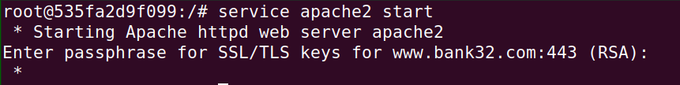

Fornecendo a password utilizada dentro do container, ```dees```, como especificado no guião, tentamos aceder ao url ```http://www.bank32.com:443/```

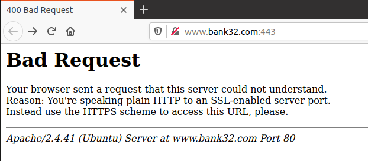

Seguindo as indicações do website colocamos ```https://``` no início do url, conseguindo assim aceder ao website

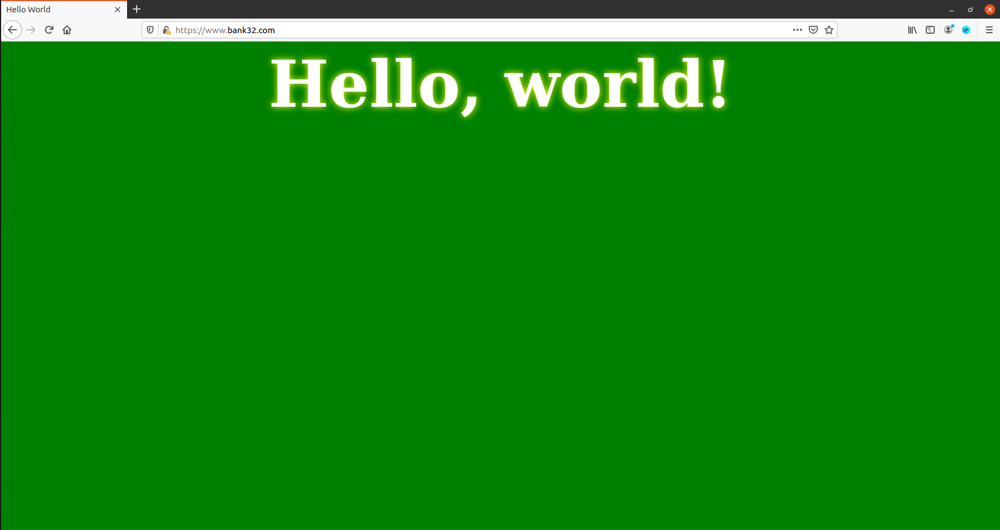

Verificamos que a ligação não era segura, ou seja, para o alcançar teriamos de adicionar o certificado que criamos às autoridades no browser a ser utilizado.
Escrevemos ```about:preferences#privacy``` na barra de endereços e clicamos no botao ```View certificates```

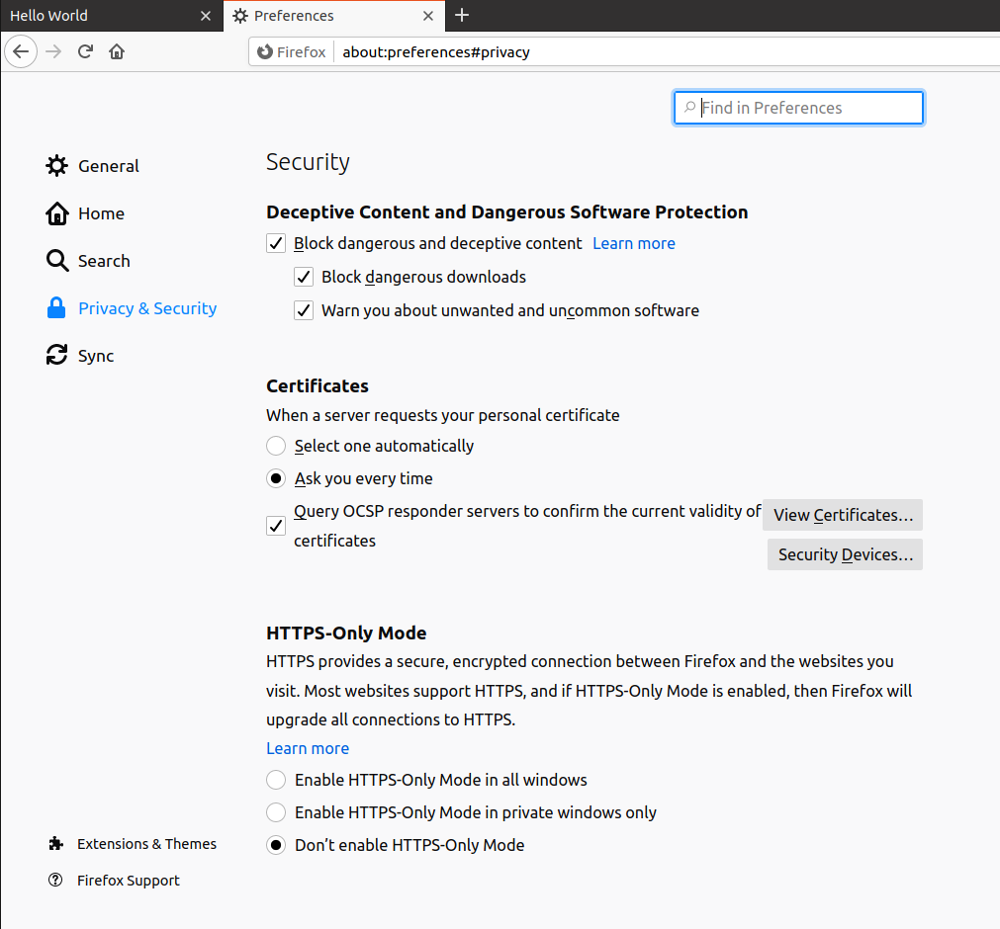

Clicamos em ```import``` e selecionamos o nosso ficheiro ```ca.crt```, o certificado de Autoridade de Certificação.

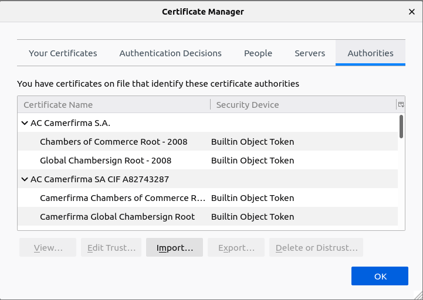

Ativamos a opção ```Trust this CA to identify websites``` como especificado no guião

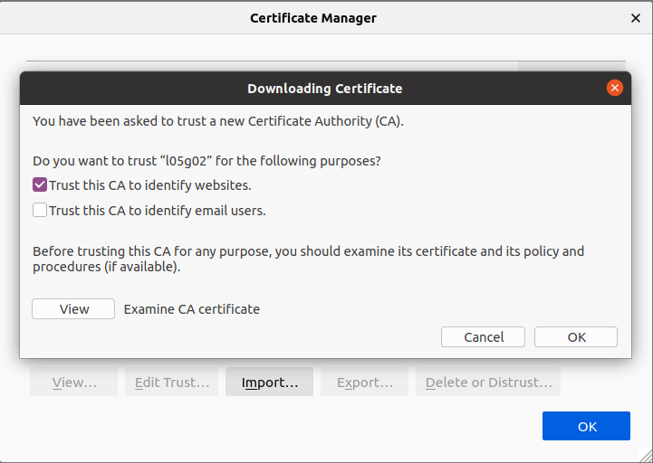

Verificamos que a ligação passou então a ser segura.

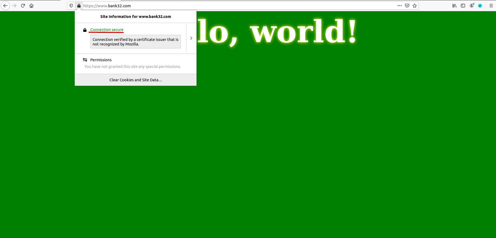

## Tarefa 5: Lançar um ataque do tipo Man-In-The-Middle

Para conseguirmos que o pedido HTTPS do utilizador se refira ao nosso servidor web, inserimos ```10.9.0.80 www.example.com``` no ficheiro etc/hosts, ligando o _hostname_ ```www.example.com``` ao IP do webserver malicioso.

Correndo o comando ```service apache2 restart```, e tentando aceder ao website ```www.example.com```, recebemos um alerta do browser que nos indica que este só confia em websites que provam a sua identidade através de certificados. 

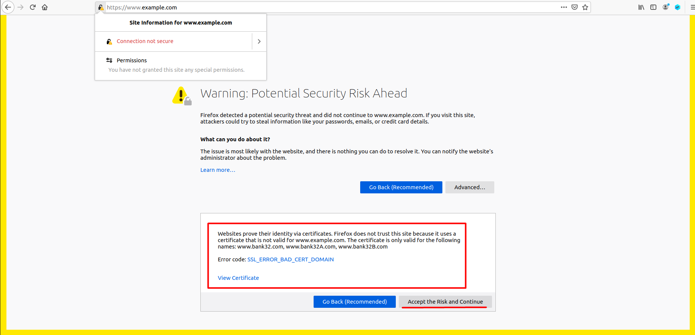

Sendo que o website que estamos a tentar aceder usa um certificado que é valido apenas para os domínios ```www.bank32.com```, ```www.bank32A.com``` e ```www.bank32B.com``` e nao para ```example.com``` a única maneira de aceder ao website é aceitando o potencial risco de segurança.

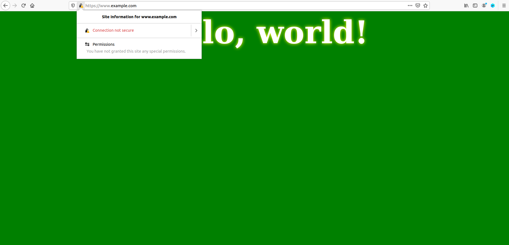

## Tarefa 6: Lançar um ataque do tipo Man-In-The-Middle com um Certificado Autenticador comprometido

Com o objetivo de criar um certificado para o website ```www.example.com```, respetimos o processo realizado nas Tarefas 2 e 3.

Gerar o _Certificate Signing Request_:

```shell
openssl req -newkey rsa:2048 -sha256 \
-keyout example.key -out example.csr \
-subj "/CN=www.example.com/O=example Inc./C=US" \
-passout pass:qwerty \
-addext "subjectAltName = DNS:www.example.com, DNS:www.exampleA.com, DNS:www.exampleB.com"
```

Gerar o certificado para o nosso servidor:

```shell
openssl ca -config openssl.cnf -policy policy_anything \
-md sha256 -days 3650 \
-in example.csr -out example.crt -batch \
-cert ca.crt -keyfile ca.key
```

Modificamos também o ficheiro de configuração do servidor ```etc/apache2/sites-available/bank32_apache_ssl.conf``` para utilizar os novos ficheiros ```example.crt``` e ```example.key```

```shell
<VirtualHost *:443> 
    DocumentRoot /var/www/bank32
    ServerName www.bank32.com
    ServerAlias www.bank32A.com
    ServerAlias www.bank32B.com
    ServerAlias www.bank32W.com
    DirectoryIndex index.html
    SSLEngine On 
    SSLCertificateFile /certs/example.crt       <----
    SSLCertificateKeyFile /certs/example.key    <----
</VirtualHost>
```

Correndo o comando ```service apache2 restart```, e tentando aceder ao website ```www.example.com``` verificamos que a ligação era segura sem termos tido qualquer tipo de aviso de potencial risco do browser.

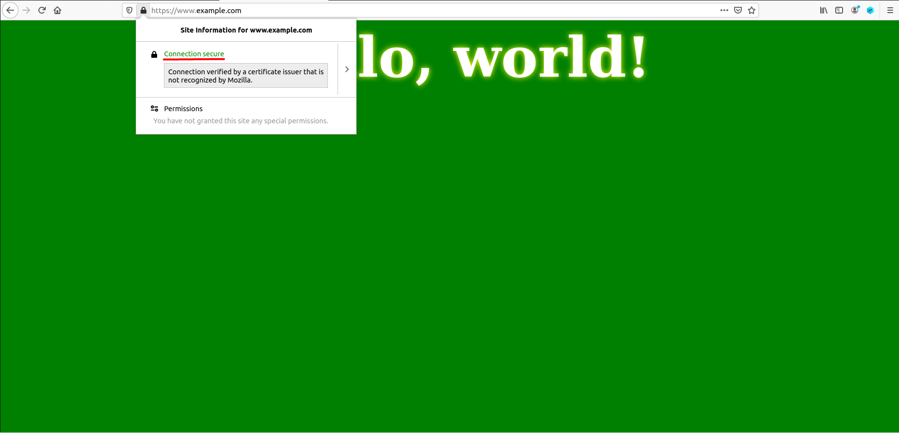

# CTF RSA

A descoberta da _flag_ foi feita com recurso a um _script_ em Python. Em primeiro lugar, há que realizar duas importações:

```python
from binascii import unhexlify
import random
```

A primeira servir-nos-á para converter entre formatos da representação da _flag_ encriptada recebida. A segunda importa uma biblioteca que permite a geração de números aleatórios, o que será utilizado pelo algoritmo de Miller-Rabin.

Seguimos analisando o ficheiro fornecido na plataforma de CTF, do qual extraímos uma função de desencriptação:

```python
# Fornecida na plataforma CTF FSI

def dec(y, d, n):
    int_y = int.from_bytes(unhexlify(y), "little")
    x = pow(int_y, d, n)
    return x.to_bytes(256, 'little')
```

O algoritmo de Miller-Rabin, adaptado dos conteúdos da página disponível em https://www.geeksforgeeks.org/primality-test-set-3-miller-rabin/ (consultada a 15/12/2023):

```python
# Adaptado de https://www.geeksforgeeks.org/primality-test-set-3-miller-rabin/

def millerRabin(d, n):
    a = random.randint(2, n - 2)
    x = pow(a, d, n)
    
    if (x == 1 or x == n-1):
        return True
    
    while (d != n - 1):
        x = (x*x) % n
        d *= 2
        if (x == 1):
            return False
        elif (x == n-1):
            return True
    
    return False

def isPrime(n, nTests):
    if (n <= 1):
        return False
    elif (n == 2 or n == 3):
        return True
    elif (n % 2 == 0):
        return False
    

    d = n - 1
    while (d % 2 == 0):
        d //= 2
    
    for i in range(nTests):
        if (not(millerRabin(d, n))):
            return False
    
    return True
```

É ainda necessário termos um método que nos permita encontrar qual o primo imediatamente a seguir a um dado número, o que nos auxiliará a descobrir os primos ```p``` e ```q``` geradores do módulo ```n```:

```python
def isEven(n):
    return (n % 2 == 0)

def nextPrime(n):
    if (isEven(n)):
        x = n + 1
    else:
        x = n + 2
    while (not(isPrime(x, 4))):
        x += 2
    return x
```

A função ```isPrime``` cumpre tal propósito, retornando o primo que se segue a um dado inteiro ```n```.

De seguida, através do comando ```nc ctf-fsi.fe.up.pt 6004```, interagimos com o servidor, que nos devolve ```e```, o expoente público, ```n```, o módulo utilizado na encriptação e ```ciphertext```, que contém a _flag_ encriptada:

```python
e = 65537
n = 359538626972463181545861038157804946723595395788461314546860162315465351611001926265416954644815072042240227759742786715317579537628833244985694861278969848734110924373658384306876548820603557497243140249901524195162137126537374247127454040576001355748709662692711025507819889382169478533854417267797250049773
ciphertext = "6331323664656235323939343863303737366634643063316264353563363232613861326164316263386433376462386433303239356336363730393264363766393037626561383761313634343262333861373738623764333139383439306531373764653136356630316666343761636262653538616562613632313964633263333536396639653334313235373664356634323862363733356134643030656437363662616364373631643862336563363139366434396435656262623264376531623531353566643439643664323063633064393565333130616138383636306338346334646134306435623938643938653536656261636139383930313030303030303030303030303030303030303030303030303030303030303030303030303030303030303030303030303030303030303030303030303030303030303030303030303030303030303030303030303030303030303030303030303030303030303030303030303030303030303030303030303030303030303030303030303030303030303030303030303030303030303030303030303030303030303030303030303030303030303030303030303030303030303030303030303030303030303030303030303030303030303030303030303030303030303030303030303030303030303030303030303030303030303030303030303030"
```

Sabendo que ```p``` e ```q``` são primos próximos de 2^512 e 2^513, respetivamente, definimos intervalos de semi-amplitude 5000, para os mesmos:

```python
P_MIN_THRES = (2**512) - 5000
P_MAX_THRES = (2**512) + 5000

Q_MIN_THRES = (2**513) - 5000
Q_MAX_THRES = (2**513) + 5000
```

É altura de começar o ataque. O nosso objetivo é, então, descobrir ```p``` e ```q``` tais que ```p * q == n```. Começamos por defini-los como o primo mínimo em cada um dos intervalos respetivos (definidos no bloco de código anterior):

```python
p = nextPrime(P_MIN_THRES)
q = nextPrime(Q_MIN_THRES)
```

Seguimos com o ciclo de descoberta, que permite que ```p``` seja qualquer primo no intervalo definido. Para cada (tentativa de) valor de ```p```, ```q```, por sua vez, pode tomar qualquer primo no intervalo associado. Caso ```q``` atinja o limite desse intervalo, voltamos a tentar com um novo valor de ```p```:

```python
while (p < P_MAX_THRES):
    if (p * q == n):
        break
    elif q > Q_MAX_THRES:
        p = nextPrime(p)
        q = nextPrime(Q_MIN_THRES)
    else:
        q = nextPrime(q)
```

O ciclo termina quando encontramos, então, ```p``` e ```q``` tal que ```p * q == n```.

Com os dois primos encontrados, é altura de avançar para a desencpritação. Através do código abaixo, encontramos ```d```, o expoente da chave privada, e procedemos com a desencriptação propriamente dita:

```python
phi = (p - 1) * (q - 1)
d = pow(e, -1, phi)
flag = dec(unhexlify(ciphertext), d, n)
```

Terminamos por imprimir, então, a _flag_ no formato pretendido:

```python
print(flag.decode())
```

```
flag{09eca02646f7b0dd84a746ccce865e20}
```
