# _Sniffing and Spoofing_ Lab

## Configuração do Ambiente

Numa fase inicial, conseguimos utilizar o Docker através do comando ```dcbuild``` e iniciar os _containers_ com o comando ```dcup```.
Seguidamente, executámos o comando ```dockps``` para identificar os IDs dos diferentes _containers_ e, em 3 terminais diferentes corremos o comando ```docksh``` juntamente com o respetivo ID do container para obtermos uma _shell_ para o **_attacker_**, **hostA** e **hostB**.

## Tarefa 1.1 - Sniffing Packets

No terminal referente ao **_attacker container_**, corremos o comando ```ifconfig``` para descobrirmos o nome da respetiva interface.

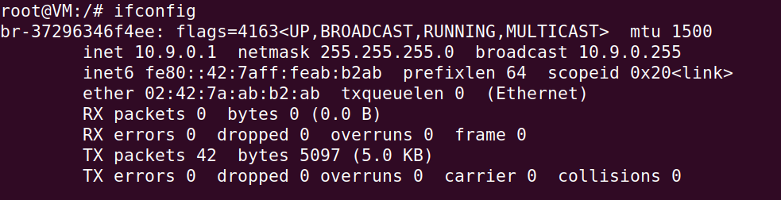

Dentro do diretório ```/volumes```, partilhado entre a VM e o _container_, criámos o programa ```task1A.py```, seguindo o _template_ disponibilizado no guião e alterando o nome da interface para o correspondente:

```py
#!/usr/bin/env python3

from scapy.all import *

def print_pkt(pkt):
  pkt.show()

pkt = sniff(iface='br-37296346f4ee', filter='icmp', prn=print_pkt)
```

Seguidamente, no terminal do **_attacker container_** corremos o comando ```chmod a+x task1A.py``` para tornarmos o programa executável e corremos, então, o programa ```task1A.py``` com previlégios de _root_.

No terminal do **_hostB container_** corremos o comando ```ifconfig``` para descobrirmos o seu IP.

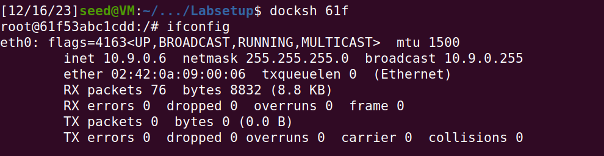

No terminal do **_hostA container_** corremos o comando ```ping 10.9.0.6```

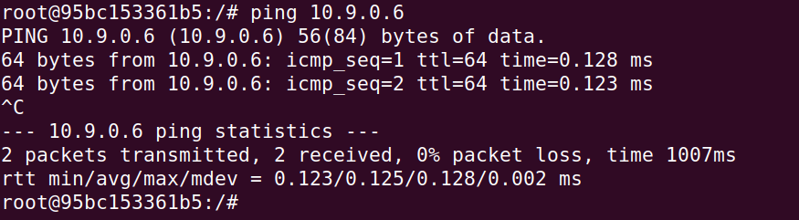

Obtivemos o seguinte output (), captura de apenas os **_ICMP Packets_**.

Corremos o comando ```su seed``` para trocarmos para a conta "seed" e corremos novamente o programa sem o previlégio de _root_.

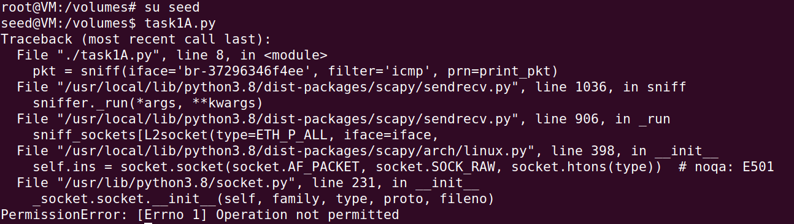

Para capturar quaisquer **_TCP packets_ provenientes de um IP específico e com uma porta de destino com o número 23**, alteramos a seguinte linha do ficheiro ```task1A.py```, inserindo no _filter_ o ip do **_hostB container_** e a porta de destino 23.

Através de uma curta pesquisa na internet, descobrimos que a _TCP Port 23_ é tipicamente utilizada pelo **_telnet protocol_**.

```py
pkt = sniff(iface='br-37296346f4ee', filter='tcp and src host 10.9.0.6 and dst port 23', prn=print_pkt)
```

Corremos novamente o programa no **_attacker container_**, e no terminal do **_hostB container_** corremos o comando ```telnet 10.9.0.5``` (ip _hostA container_) e fizemos o login com as credencias da VM, user: seed e password: dees.

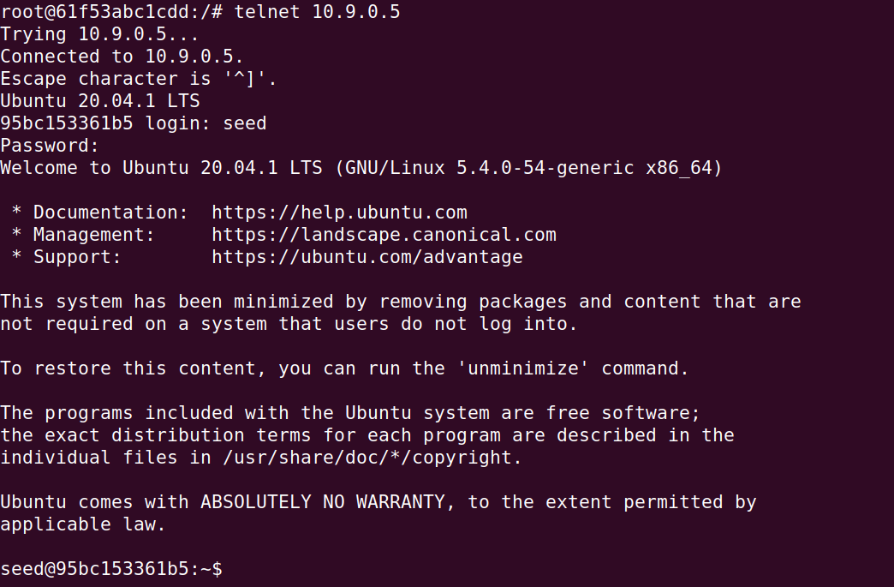

No terminal do **_attacker container_** obtivemos o seguinte output (), onde podemos verificar nas linhas 16 e 21, respetivamente, que o endereço de IP de origem é ```10.9.0.5``` e a porta de destino é ```telnet```.

Para o terceiro e último filtro alteramos novamente a seguinta linha:

```py
pkt = sniff(iface='br-37296346f4ee', filter='dst net 128.230.0.0/16', prn=print_pkt)
```

Corremos novamente o programa no **_attacker container_** e no **_hostA container_** corremos o comando ```ping 128.230.0.11```

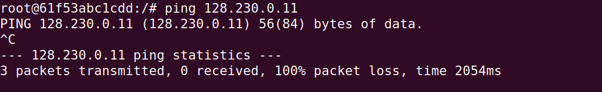

No terminal do **_attacker container_** obtivemos o seguinte output (), captura de **_packets_ provenientes de uma _subnet_ específica**.

## Tarefa 1.2 - Spoofing ICMP Packets

Criamos o ficheiro ```task1B.py``` seguindo o _template_ disponibilizado no guião:

```py
#!/usr/bin/env python3

from scapy.all import *

a = IP()
a.dst = '10.0.2.3'
b = ICMP()
p = a/b
send(p)

ls(a)
```

No terminal do **_attacker container_** corremos o comando ```chmod a+x task1B.py``` para tornarmos o programa executável.

Seguidamente abrimos o Wireshark e selecionamos a interface do _attacker_, ```enp0s3```.

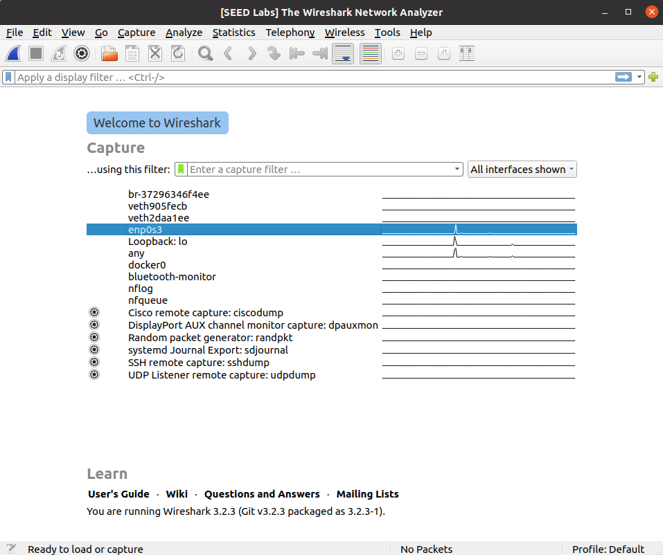

Corremos o programa ```task1B.py```:

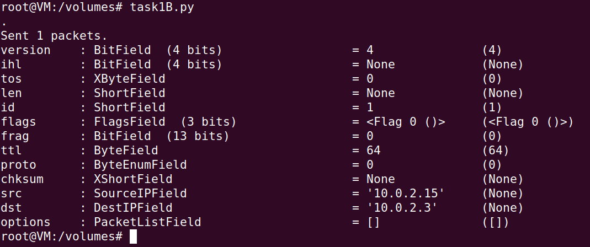

No Wireshark podemos observar que foi captrurado um _packet_ com o _source IP_ do nosso **_attacker container_** e com o destino no endereço de IP arbitrário que definimos, ```10.2.0.3```.

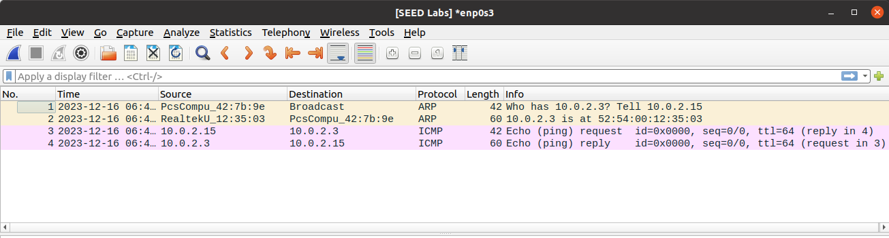

Para a nossa tentativa de _Spoofing_ alterámos o ficheiro ```task1B.py``` adicionando a seguinte linha:

```py
a.src = '10.0.2.15'
```

Repetindo o processo anterior, verificamos no Wireshark que foi capturado um _packet_ com origem no endereço de IP arbitrário especificado ```10.0.2.15```.

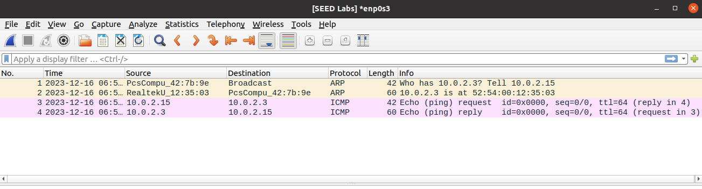

## Tarefa 1.3 - Traceroute

Criámos o ficheiro ```task1C.py```, usando o _template_ disponível no guião e fazendo algumas alterações para automatizar o processo.
Usámos um ciclo ```for``` para testar os vários valores do TTL (_Time To Live_) e um pequeno _delay_ entre envio de _packets_ para melhor visualização no Wireshark.

```py
#!/usr/bin/env python3
import time
from scapy.all import *

for ttl in range(1, 16):
  a = IP()
  a.dst = '8.8.8.8'
  b = ICMP()
  a.ttl = ttl
  send(a/b)
  time.sleep(1)
```

Corremos o comando ```chmod a+x task1C.py``` para tornarmos o programa executável, iniciamos a captura de _packets_ no Wireshark e corremos o programa ```task1C.py```.

Analisando o Wireshark verificámos que, para todos os valores de TTL anteriores a 13, como mostrado na imagem, o _'time to live'_ foi _'exceeded'_, mas a partir deste valor começamos a receber uma resposta com origem no endereço de IP ```8.8.8.8```.

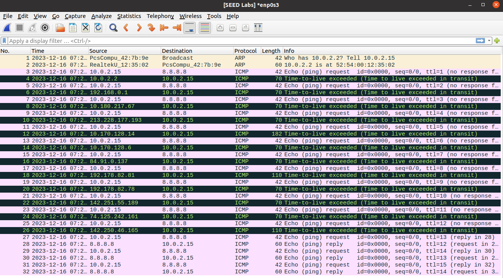

Finalmente, por questões de confirmação, corremos o comando ```traceroute 8.8.8.8``` e verificamos, através do seguinte _output_, o que tinhamos concluído anteriormente, são necessários 13 "saltos" entre routers para o _packet_ chegar ao destino final.

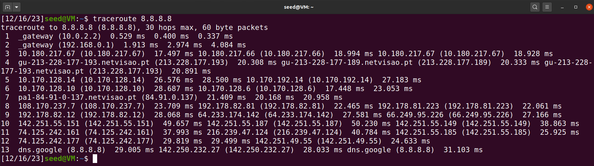

## Tarefa 1.4 - Sniffing and-then Spoofing

Criámos o ficheiro ```task1D.py```:

```py
#!/usr/bin/env python3

from scapy.all import *

def spoof_pkt(pkt):
    # sniff and print out icmp echo request packet
    if ICMP in pkt and pkt[ICMP].type == 8:
        print("Original Packet.........")
        print("Source IP : ", pkt[IP].src)
        print("Destination IP :", pkt[IP].dst)

        # spoof an icmp echo reply packet
        # swap srcip and dstip
        ip = IP(src=pkt[IP].dst, dst=pkt[IP].src, ihl=pkt[IP].ihl)
        icmp = ICMP(type=0, id=pkt[ICMP].id, seq=pkt[ICMP].seq)
        data = pkt[Raw].load
        newpkt = ip/icmp/data

        print("Spoofed Packet.........")
        print("Source IP : ", newpkt[IP].src)
        print("Destination IP :", newpkt[IP].dst)

        send(newpkt, verbose=0)

pkt = sniff(iface='br-37296346f4ee', filter='icmp and host 1.2.3.4', prn=spoof_pkt)
```
Para **_"dar ping"_ a um host não existente na Internet**, corremos o programa no **_attacker container_** e no **_hostA container_** corremos o comando ```ping 1.2.3.4```.

Terminal **_attacker container_**:

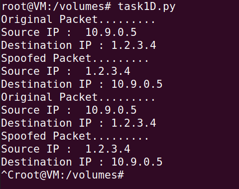

Terminal **_hostA container_**:

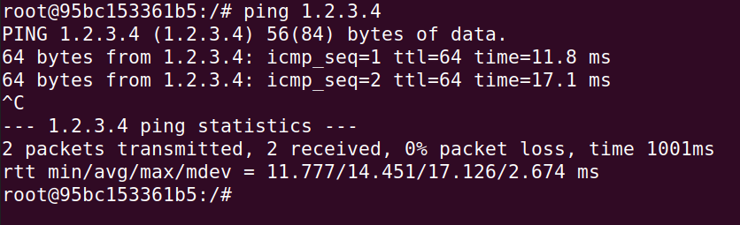

Para **_"dar ping"_ a um host não existente na LAN**, alteramos o _host_ no _filter_ na última linha do ficheiro ```task1D.py```:

```py
pkt = sniff(iface='br-37296346f4ee', filter='icmp and host 10.9.0.99', prn=spoof_pkt)
```

Corremos novamente o programa, mas desta vez no **_hostA container_** corremos o comando ```ping 10.9.0.99```

Do lado do **_attacker container_** não houve qualquer tipo de _output_.

Já do lado do **_hostA container_** recebemos as seguintes mensagens:

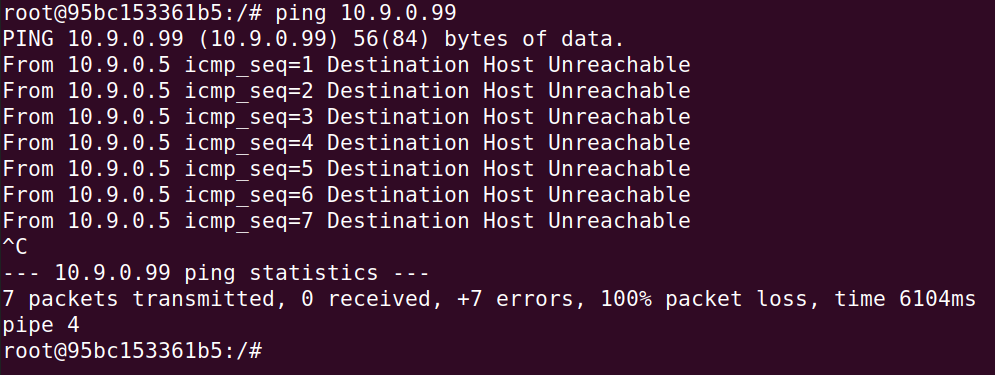

Como este endereço de IP não existe na LAN, não tem um _MAC address_ associado, logo não ha _mapping_ do endereço de IP para o _MAC address_ na _ARP table_.

Para **_"dar ping"_ a um host existente na Internet**, alteramos o _host_ no _filter_ na última linha do ficheiro ```task1D.py```:

```py
pkt = sniff(iface='br-37296346f4ee', filter='icmp and host 8.8.8.8', prn=spoof_pkt)
```

Corremos novamente o programa, mas desta vez no **_hostA container_** corremos o comando ```ping 8.8.8.8```

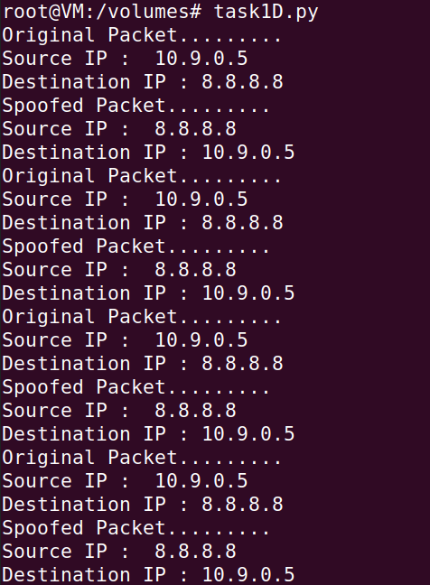

Como podemos verificar no output no terminal do **_hostA container_**, tanto recebemos _packets_ do _host_ real, como _spoofed packets_. Alguns estão marcados como DUP (duplicados).

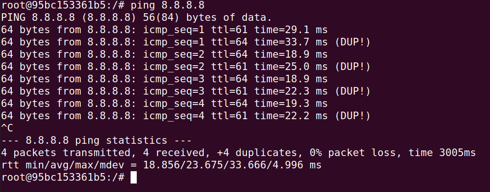

# CTF13 - _Find-my-TLS_

## Introdução
O protocolo TLS (Transport Layer Security) é um padrão criptográfico fundamental utilizado para estabelecer uma comunicação segura entre duas entidades, comumente empregado em aplicações como HTTPS, SMTPS, FTPS, entre outras. Em particular, o HTTPS garante a confidencialidade e integridade dos dados transmitidos entre clientes e servidores web.

O desafio em questão envolve a análise de um arquivo PCAP, denominado "dump.pcapng", contendo diversas conexões TLS. O objetivo é reconstruir uma flag a partir de detalhes específicos de uma conexão em particular. Esta conexão específica é identificada pelo número aleatório "52362c11ff0ea3a000e1b48dc2d99e04c6d06ea1a061d5b8ddbf87b001745a27" presente na mensagem Client Hello durante o handshake.

A estrutura da flag a ser construída segue o formato:

```bash
flag{<frame_start>-<frame_end>-<selected_cipher_suite>-<total_encrypted_appdata_exchanged>-<size_of_encrypted_message>}
```

Onde:

- <frame_start> e <frame_end> representam o primeiro e último número de frames, respectivamente, correspondentes ao procedimento de handshake do TLS.
- <selected_cipher_suite> indica a ciphersuite escolhida para a conexão TLS, referindo-se ao seu nome, não ao código.
- <total_encrypted_appdata_exchanged> é a soma total do tamanho dos dados cifrados trocados neste canal até à sua terminação.
- <size_of_encrypted_message> refere-se ao tamanho da mensagem cifrada no handshake que conclui o procedimento de handshake.


## Análise Detalhada

Para realizar essa tarefa, será empregada a ferramenta Wireshark, uma aplicação especializada na análise de tráfego de rede. A abordagem adotada envolverá a identificação da conexão relevante, seguida da análise dos frames associados ao procedimento de handshake do TLS.


## Resolução

## Primeiro Passo

Utilizamos a ferramenta Wireshark para conduzir a análise do arquivo "dump.pcapng". O processo iniciou-se aplicando um filtro específico, _tls.handshake.random == 52:36:2c:11:ff:0e:a3:a0:00:e1:b4:8d:c2:d9:9e:04:c6:d0:6e:a1:a0:61:d5:b8:dd:bf:87:b0:01:74:5a:27_, a fim de selecionar exclusivamente a conexão que faz uso do número aleatório fornecido.

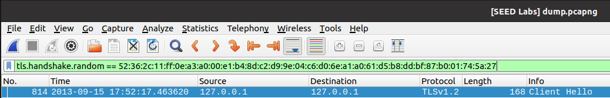

### Análise do Handshake e Conclusão do Procedimento TLS

Com base nos resultados obtidos, identificamos que o início do procedimento de handshake ocorre no frame 814. Este é o momento em que o cliente (Client Hello) inicia a negociação com o servidor, incluindo a apresentação de informações cruciais, como a escolha da ciphersuite e o número aleatório mencionado anteriormente.

Adicionalmente, ao compreender o funcionamento do protocolo TLS, reconhecemos que o handshake é finalizado quando o servidor envia um "New Session Ticket" para o cliente, indicando que está pronto para receber dados criptografados. O frame 819 corresponde a este procedimento, marcando o encerramento do handshake e o estabelecimento da conexão segura.

Essa identificação precisa dos momentos-chave no procedimento de handshake não apenas contribui para a determinação do <frame_start> e <frame_end> na estrutura da flag, mas também realça a importância de compreender a sequência de eventos no contexto do protocolo TLS.

De momento a nossa flag está preenchida da seguinte forma:

```bash
flag{814-819-<selected_cipher_suite>-<total_encrypted_appdata_exchanged>-<size_of_encrypted_message>}
```

## Segundo Passo

### Identificação da Cipher Suite na Frame 814

No segundo passo da resolução, focamos na determinação da ciphersuite utilizada durante o handshake, concentrando-nos no frame 814. Para realizar essa tarefa, exploramos a camada TLS na estrutura do frame, especificamente procurando o campo "Cipher Suite".

Na análise detalhada do frame 814, encontramos que a ciphersuite utilizada nessa conexão específica é TLS_RSA_WITH_AES_128_CBC_SHA256. Esse valor é crucial para preencher o campo <selected_cipher_suite> na estrutura da flag.

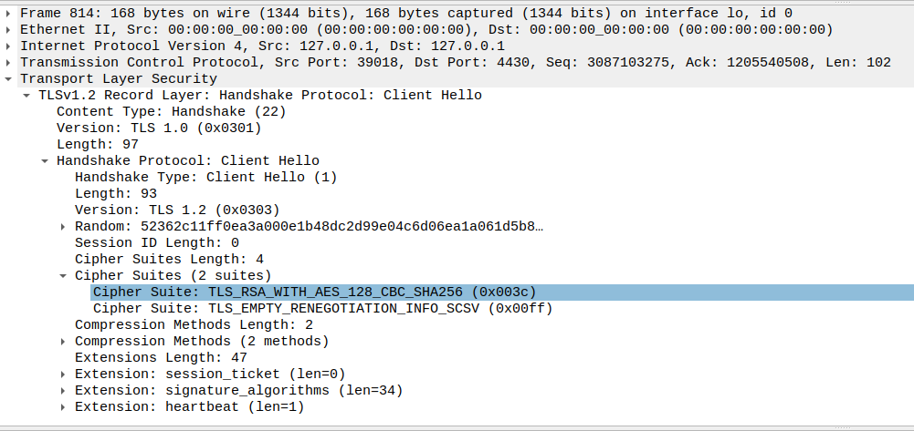

### Considerações Teóricas sobre a Cipher Suite

A ciphersuite TLS_RSA_WITH_AES_128_CBC_SHA256 refere-se a um conjunto específico de algoritmos criptográficos empregados durante a comunicação segura. Aqui, "TLS_RSA" indica o uso do algoritmo de troca de chaves RSA, enquanto "AES_128_CBC" refere-se ao algoritmo de cifra simétrica AES com um bloco de tamanho 128 bits operando em modo de cifra de bloco de cadeia de caracteres (CBC). Por fim, "SHA256" representa o uso do algoritmo de hash SHA-256 para garantir a integridade dos dados.

De momento a nossa flag está preenchida da seguinte forma:

```bash
flag{814-819-TLS_RSA_WITH_AES_128_CBC_SHA256-<total_encrypted_appdata_exchanged>-<size_of_encrypted_message>}
```

## Terceiro Passo

### Determinação do Tamanho Total dos Dados Cifrados Trocados

No terceiro passo da resolução, concentramo-nos em calcular o tamanho total dos dados cifrados trocados durante a conexão. Para realizar essa tarefa, observamos os dois frames "Application Data" que precedem o encerramento do handshake (frame 819). Os frames em questão são o 820 e o 821.

### Frame 820

No frame 820, identificamos que o campo "Length" indica o tamanho dos dados cifrados, que neste caso é 1184 bytes.

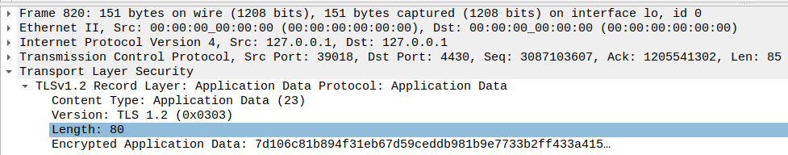

### Frame 821

Analogamente, no frame 821, o campo "Length" indica o tamanho dos dados cifrados, sendo neste caso 80 bytes.

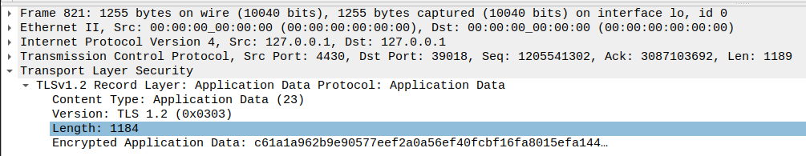

Somando os valores dos campos "Length" dos dois frames (1184 + 80), obtemos o tamanho total dos dados cifrados trocados, que é 1264 bytes.

De momento a nossa flag está preenchida da seguinte forma:

```bash
flag{814-819-TLS_RSA_WITH_AES_128_CBC_SHA256-1264-<size_of_encrypted_message>}
```

## Quarto Passo

### Conclusão e Construção da Flag

No último passo da resolução, dirigimos nossa atenção ao frame 818 para determinar o tamanho da mensagem cifrada no handshake que conclui o procedimento. Ao examinar o campo "Length" deste frame específico, identificamos que o valor é 80 bytes.

Com todos os valores necessários coletados durante a análise detalhada, a estrutura da flag é completamente preenchida:

```bash
flag{814-819-TLS_RSA_WITH_AES_128_CBC_SHA256-1264-80}
```
