# Environment Variable and Set-UID Lab

## Tarefa 1 - Manipulação de variáveis de ambiente

Observámos que os comandos ```printenv``` e ```env``` permitem consultar as variáveis de ambiente do sistema e seus valores.

Através de ```export MY_VAR=10```, adicionámos uma nova v.a. de nome ```MY_VAR```e valor ```10```, o que pôde ser comprovado através de ```printenv | grep MY_VAR``` (_output_ ```MY_VAR=10```). De seguida, procedemos à remoção desta v.a., com ```unset MY_VAR```, o que foi confirmado, novamente, recorrendo a ```printenv | grep MY_VAR```, cujo _output_, desta vez, foi vazio.

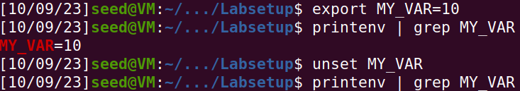

## Tarefa 2 - Passagem de v.a. de processo-pai para processo-filho

Foi compilado e executado myprintenv.c, sendo o seu _output_, o conjunto de v.a. do processo.pai, gravado para um ficheiro, file. De seguida, foram feitas as alterações descritas no guião, o programa, que imprimiu as v.a. do proesso-filho, foi compilado e executado e o seu _output_ gravado para file2.

Por último, executámos o comando ```diff file file2```, que não retornou qualquer informação, o que significa que não há diferença entre os dois ficheiros. Portanto, não há diferença entre o conjunto de v.a. do processo-pai e o do processo-filho.

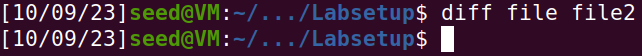

Através do comando ```man fork```, percebemos que o processo-filho é uma cópia do processo-pai. Então, tendo esta informação em conta, além do descrito anteriormente, produzido através da reprodução do descrito no guião, podemos concluir que o processo-filho terá as mesmas variáveis de ambiente que o processo-pai.

## Tarefa 3 - Variáveis de Ambiente e ```execve()```

Após compilar e executar myenv.c pela primeira vez, não se observou qualquer _output_.

Ao executar o segundo passo, tendo efetuado a alteração descrita no guião, observamos, finalmente, o _output_ de inúmeras variáveis de ambiente.

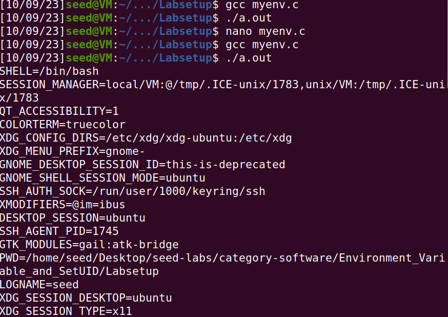

Ora, analisando o código e os efeitos causados pela alteração ao mesmo, concluimos que a herança das variáveis de ambiente por parte do novo programa apenas ocorre se assim o especificarmos na chamada de ```execve()```. É o que acontece no segundo caso, em que o terceiro argumento passado à função é ```environ```, que contem as v.a. do primeiro programa.

## Tarefa 4 - Variáveis de Ambiente e ```system()```

Compilando e executando o código pedido, vemos o _output_ das mesmas v.a. que temos observado até agora.

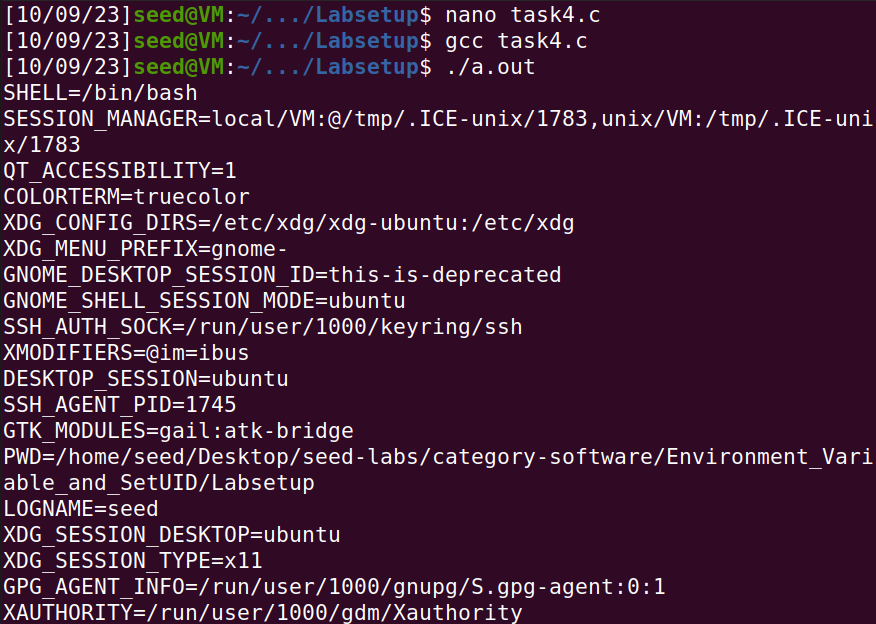

Assim, constatamos que um novo programa executado através de ```system()``` herda as v.a., o que está de acordo com a informação fornecida ao executar no terminal o comando ```man system```.

## Tarefa 5 - Variáveis de Ambiente e Programas ```SET-UID```

Usando o comando ```printenv``` para conhecer as v.a. existentes, observámos que PATH existia e tinha conteúdo, mas não ```LD_LIBRARY_PATH```.

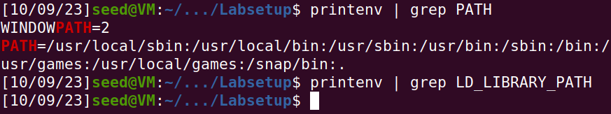

Depois de usar ```export``` para esta última e para a v.a. por nós definida (```MY_VAR```), corremos o código pedido e verificámos que tanto ```PATH``` como ```MY_VAR``` são impressas, ao contrário de ```LD_LIBRARY_PATH```, algo surpreendente para nós.

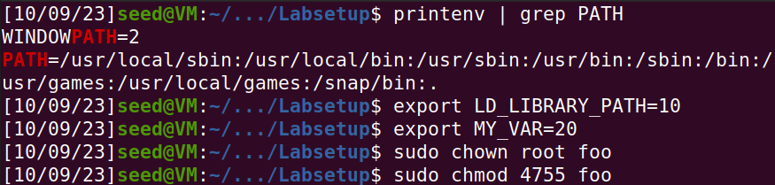
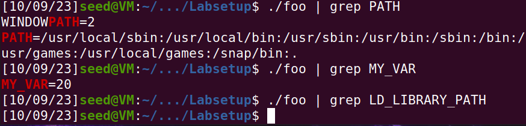

## Tarefa 6 - A Variável de Ambiente ```PATH``` e Programas ```SET-UID```

Compilou-se o código pedido para um programa ```task6```, que chama ```system("ls")``` e executou-se ```sudo chown root task6``` e ```sudo chmod 4755 task6```.

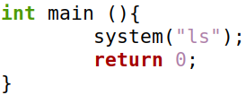

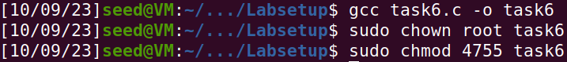

De seguida, criou-se um programa ```ls``` "falso" no ambiente de trabalho, que imprime "Fake!". Seguimos os passos descritos na nota do enunciado da tarefa, para contornar o mecanismo de proteção contra a característica a ser explorada. Executando ```export PATH=/home/seed/Desktop:$PATH``` para adicionar o diretório do programa "malicioso" ao início da v.a. ```PATH``` e correndo o programa ```task6```, que invoca ```system("ls")```, pudemos verificar o _output_ "Fake ls!", comprovando, assim, que é possível manipular os programas ```SET-UID``` através das suas v.a. para executar código arbitrário de forma aparentemente legítima.

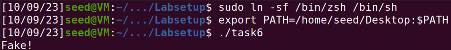

# CTF Linux Environment

## 1\. _Setup_ de Environment Variables


Corremos o comando acima para configurar as variáveis de ambiente ```LD_PRELOAD``` e ```PATH``` para assegurar que o sistema de carregue uma biblioteca customizada (```lib```) e procure executáveis no diretório ```/tmp```.

## 2\. Mudança para Diretório Temporario


Com o comando ```cd /tmp```, podemos mudar o _working directory_ para ```/tmp```, onde vamos criar e mudar permissões de acesso ficheiros.

## 3\. Criação um ficheiro de texto ```file.txt```


Criamos um ficheiro de texto vazio (```file.txt```) no diretório ```/tmp```.

## 4\. Alteração de permissões de ```file.txt```


Com o comando ilustrado, atribuímos a ```file.txt``` permissões de leitura, escrita e execução tanto para o proprietário do ficheiro, como para o grupo e outros utilizadores.

## 5\. Criação de uma biblioteca partilhada com código-fonte personalizado

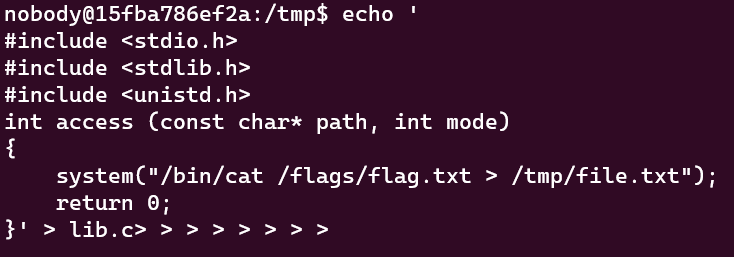

O comando supra cria um ficheiro de C ```lib.c``` no diretório ```/tmp```. Define uma função customizada ```access```, que, quando chamada, executa o comando ```cat```, que lê o conteudo de ```/flags/flag.txt``` e escreve no ```file.txt```, que está em ```/tmp```.

## 6\. Compilação da biblioteca partilhada costumizada


Compilamos o ```lib.c``` para criarmos um _object file_.

## 7\. Conecção do _Object File_ para criação da biblioteca partilhada


Conectamos o file ```lib.o``` para criar a biblioteca partilhada ```lib```. Esta será carregada pelo sistema.

## 8\. Alteração de permissões da biblioteca


Com o ilustrado na figura acima, atribuímos permissões de execução, escrita e leitura à bibliotca, assegurando o seu carregamento pelo sistema.

## Observações finais

### Envio dos comandos de uma só vez

Num ambiente partilhado, onde vários utilizadores têm acesso a um servidor, é importante compreender que quaisquer alterações feitas no mesmo terão efeito sobre aquilo a que os outros utilizadores acedem, podendo ser modificadas ou eliminadas por estes. Para contornar este desafio e garantir que os nossos comandos são executados cabalmente, é necessário enviá-los como um só. Assim, garante-se que nenhuma parte do _script_ é alterada ou removida por outros utilizadores durante a execução. Esta é uma prática comum em ambientes partilhados para manter a integridade das operações pretendidas.

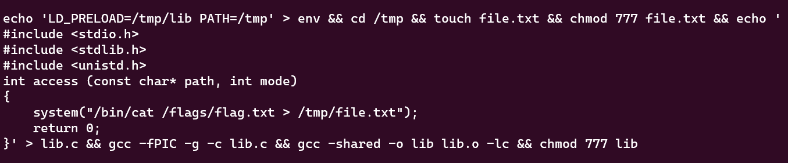

### O Temporizador do Servidor

O servidor possui um temporizador configurado para executar um _script_ específico em intervalos regulares; neste caso, a cada minuto. Foi configurado da seguinte forma:


O que faz o temporizador:

- É executado a cada minuto, executando o comando especificado após o agendamento do dito temporizador.
- É executado com as permissões do utilizador ```flag_reader```.
- Executa ```/bin/bash``` para iniciar uma _shell_ Bash.
- Dentro da _shell_, executa um _script_ localizado em ```/home/flag_reader/my_script.sh```.
- A saída deste _script_ é encaminhada para ```/home/flag_reader/last_log```.

O temporizador é executado com as permissões do utilizador ```flag_reader```, que geralmente tem acesso restrito. No entanto, ao explorar as variáveis de ambiente personalizadas e a biblioteca partilhada (```lib```), conseguiu manipular-se o comportamento do sistema para aceder à _flag_, que estava localizada em ```/flags/flag.txt```. A sua função _access_ personalizada, quando invocada pelo sistema, executou o comando ```cat``` para ler o conteúdo da flag e escrevê-lo em ```/tmp/file.txt```. Uma vez que o temporizador estava configurado para ser executado regularmente, pôde intercetar a _flag_ à medida que era atualizada ou lida, permitindo resolver o desafio CTF com sucesso.

Neste cenário CTF, compreender a configuração do servidor, o ambiente partilhado e o comportamento do temporizador foi crucial para subverter com sucesso o sistema e obter a _flag_ escondida.
