# SQL Injection Lab

## Configuração do Ambiente

Numa fase inicial, acrescentámos um novo _host_ através do comando ```sudo nano /etc/hosts``` para possibilitar a execução dos _containers_ fornecidos no Lab, adicionando uma nova linha com ```10.9.0.5  www.seed-server.com``` ao ficheiro ```/etc/hosts```. Desta forma, conseguimos utilizar o Docker através do comando ```dcbuild``` e iniciar o _container_ com o comando ```dcup```.

Simultaneamente, noutro terminal, executámos os comandos ```dockps``` para identificar os IDs dos _containers_ e utilizámos o comando ```docksh``` juntamente com o ID do _container_ ```mysql_data``` para aceder a uma _shell_ dentro do mesmo.

Dentro da _shell_ do _container_ MySQL, utilizámos o comando ```mysql -u root -pdees``` para ganhar privilégios de utiliador _root_. No final, usamos o comando ```use sqllab_users;``` para selecionar o esquema da base de dados.

## Tarefa 1: Familiarizar-nos com SQL Statements

A primeira tarefa consistia em familiarizarmo-nos mais com os comandos SQL. Dado que já estamos bastante familiarizados com esta linguagem, conseguimos completar o que foi solicitado. Mostramos as tabelas através do comando ```show tables;```. 

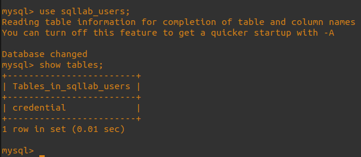

E recolhemos todas as informações relativas a Alice na tabela ```credentials```. Utilizámos o código abaixo para realizar esta operação :

```sql
SELECT * FROM credential WHERE Name = 'Alice';
```

Eis a informação que recolhemos:

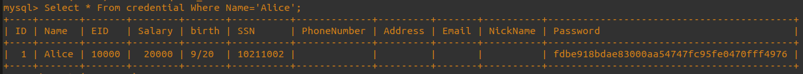

## Tarefa 2: Ataque de SQL Injection no SELECT _Statement_

### 2.1 - Ataque de SQL Injection a partir da página _web_

Acedemos ao website ```www.seed-server.com``` disponibilizado pelo _container_ do Docker e ao ficheiro de código ```unsafe_home.php```. Ao analisar o código, verificamos a ausência de uma adequada sanitização na parte responsável pelo processo de _login_, o que facilita um potencial ataque por SQL Injection.

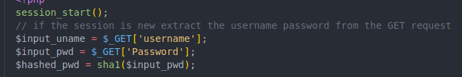
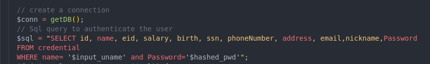

Ao aproveitarmos a ausência de sanitização nos _inputs_, podemos injetar código SQL na caixa do utilizador. Para realizar o _login_ como administrador sem a necessidade de uma palavra-passe, basta inserir ```Admin' --```. Esta abordagem garante que o utilizador para o qual pretendemos efetuar o login é o administrador. O uso de ``` -- ``` permite comentar o restante código SQL. É importante notar que é necessário adicionar um espaço após os dois traços, caso contrário não conseguiremos comentar o resto da linha, o que impediria a entrada como administrador.

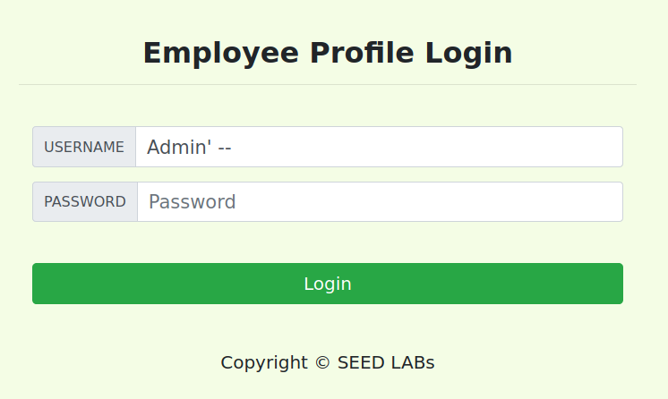

Tal como esperado, conseguimos efetuar o _login_ com a conta de administrador, obtendo, assim, todos os dados relacionados com os restantes utilizadores do _website_:

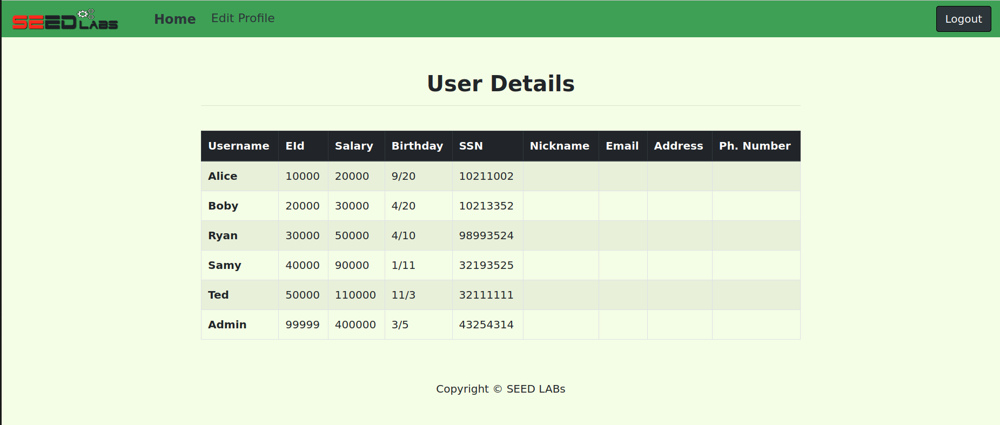

### 2.2 - Ataque de SQL Injection a partir da Linha de Comandos

Nesta ocasião, conduzimos o ataque através de um pedido GET. Um exemplo de um pedido ao servidor na linha de comandos seria:

```shell
curl "www.seed-server.com/unsafe_home.php?username=UTILIZADOR&Password=PALAVRAPASSE"
```

Utilizando o mesmo input da secção anterior, mas desta vez codificado com as convenções (```%27 = '``` e ```20 = ' '```), temos o seguinte comando malicioso:

```shell
curl "www.seed-server.com/unsafe_home.php?username=Admin%27%20--%20"
```

É importante notar que, mais uma vez, é necessário adicionar um espaço após os dois traços (%20), caso contrário não conseguiríamos comentar o restante da linha, impedindo assim a entrada como administrador.

Deste modo, conseguimos obter o código HTML de toda a página, que continha os dados pessoais dos utilizadores.

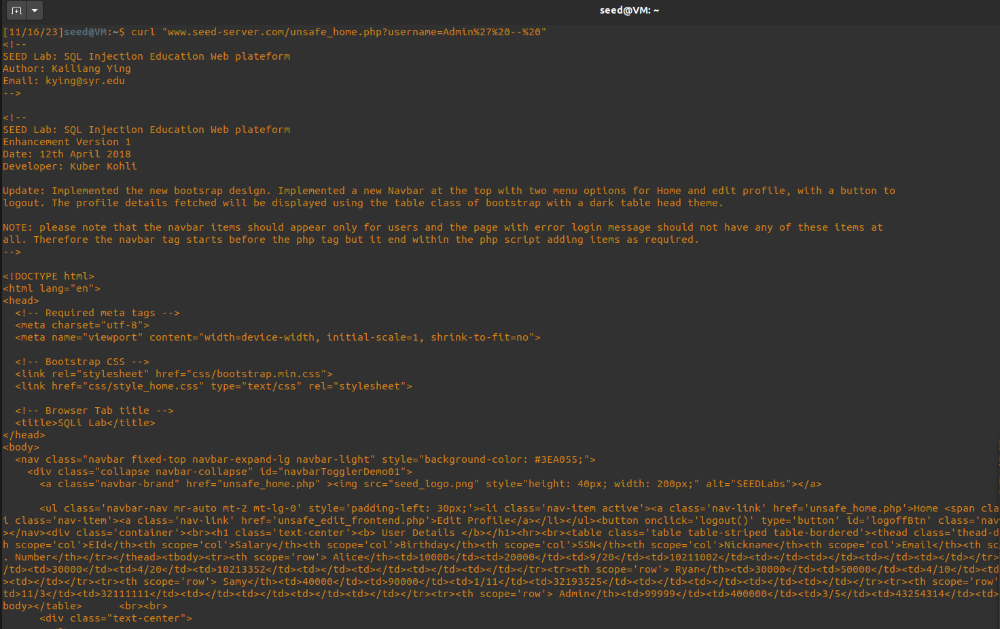

### 2.3 - Adicionar um novo comando SQL 

Podemos adicionar novos comandos SQL usando ```;```. Para tal, alteramos o nosso _input_ malicioso inicial para que tenha um efeito colateral no servidor, como, por exemplo, eliminar a entrada correspondente a "Boby" na tabela ```credentials```:

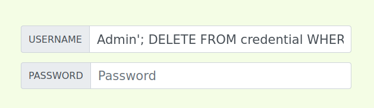
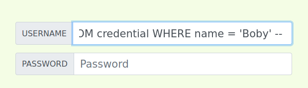

Contudo, a operação não foi concluída devido a um erro na base de dados:

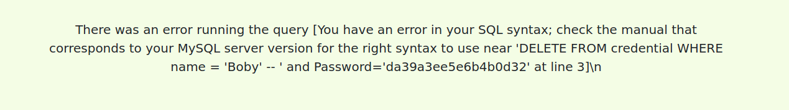

Conforme indicado no manual de PHP, na secção de "Multiple Statements" ([link para o manual](https://www.php.net/manual/en/mysqli.quickstart.multiple-statement.php)), a extensão MySQL utilizada pelo PHP no servidor possui uma proteção que impede a execução de múltiplas queries, o que resultou na impossibilidade de concluir o ataque.

## Tarefa 3: Ataque de SQL Injection no UPDATE _Statement_

### 3.1 - Modificar o meu próprio salário

Após efetuar _login_ com uma conta do sistema, neste caso, utilizando a conta da Alice, conseguimos aceder a uma página destinada à edição de dados pessoais:

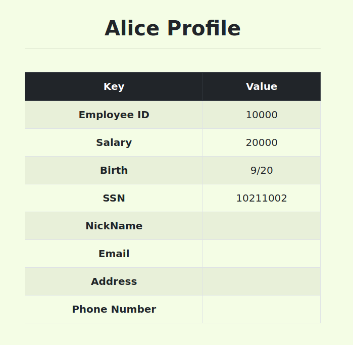

Esta página é gerida através do ficheiro disponibilizado ```unsafe_edit_backend.php```, que contém uma _query_ também construída dinamicamente com _strings_ não sanitizadas provenientes do _input_ do utilizador.

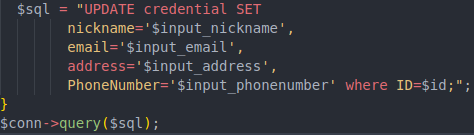

O nosso ataque centra-se na manipulação do campo ```Phone Number```. Utilizando a técnica aplicada nas tarefas anteriores anteriores, temos o seguinte código, capaz de influenciar o salário do utilizador:

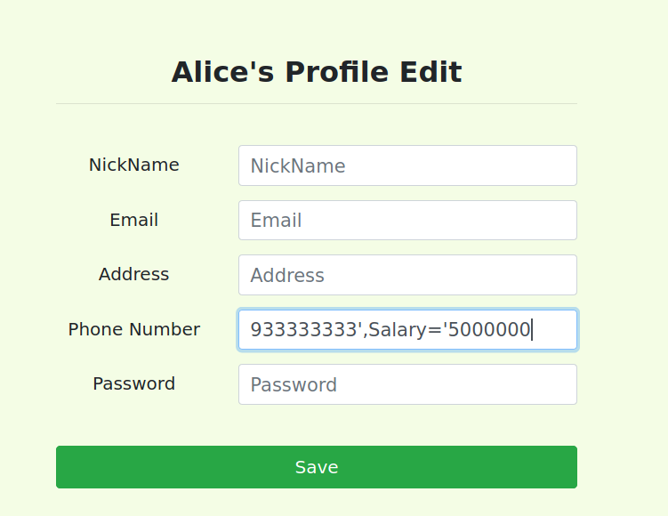

Conforme antecipado, a variável do salário foi igualmente modificada para o valor escolhido:

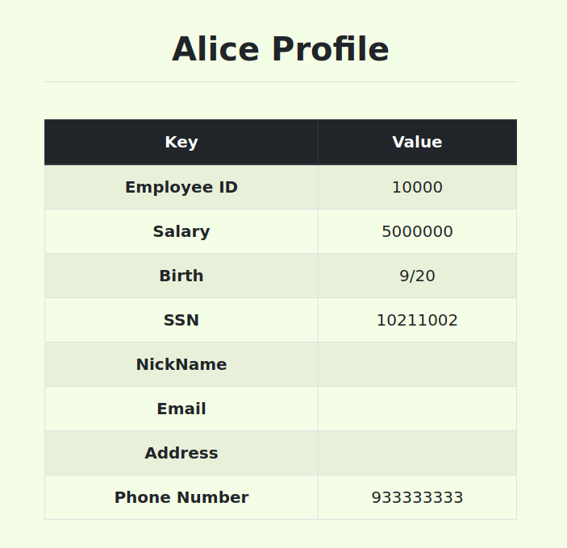

### 3.2 - Modificar o salário de outro Utilizador

Para modificar o valor do salário de outro utilizador, utilizamos uma técnica semelhante à anterior. No entanto, criamos uma cláusula ```WHERE``` diferente e comentamos a existente no sistema para não interferir na pesquisa. Neste caso, vamos atualizar o salário e algumas informações sobre o chefe de que ninguém gosta, o Boby:

```sql
969696969',Salary='40' WHERE Name='Boby' -- 
```

Aqui é possível visualizar o valor do salário do Boby antes de e após o ataque:

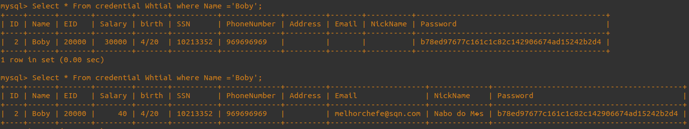

### 3.3 - Modificar a palavra-passe de outro Utilizador

Para modificar a palavra-passe de outro utilizador, aplicamos uma técnica semelhante à anterior. Desta vez, o valor a ser modificado foi previamente cifrado através de SHA1, a mesma utilizada para cifrar as palavras-passe no _website_. Por exemplo, para a nova palavra-passe ```MeninoDoISEP```, o _hash_ correspondente é ```290af5c82687056584f557008bb6a359746ccff5```.

```sql
969696969',Password='290af5c82687056584f557008bb6a359746ccff5' WHERE Name='Boby' -- 
```

Com a nova palavra-passe alterada, conseguimos aceder à conta do Boby:

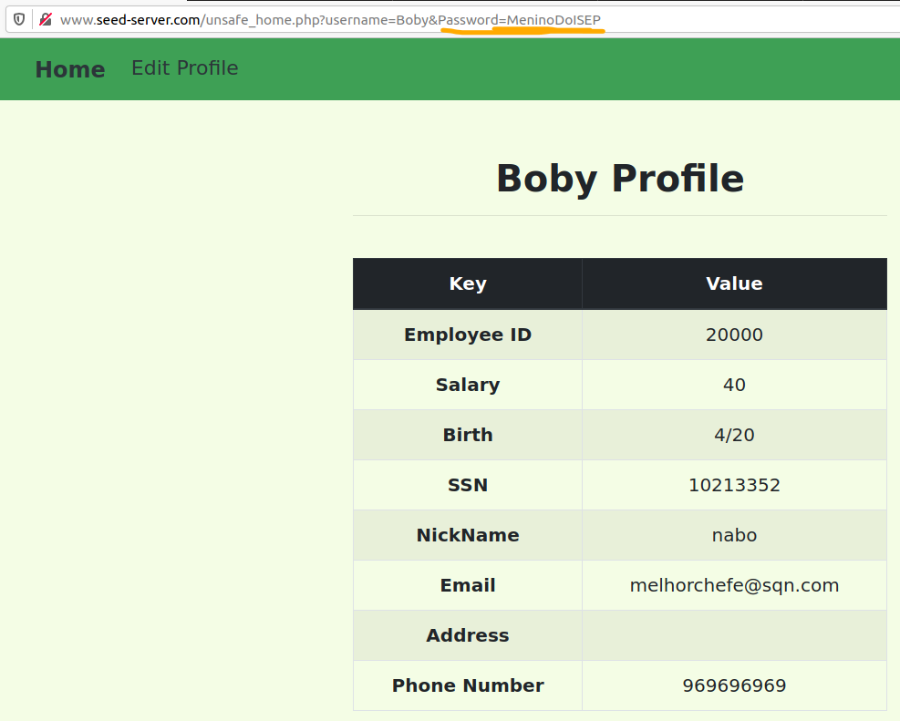

# CTF SQL Injection

## Analisando o código vulnerável

Espreitando o código do ficheiro fornecido, ```index.php```, rapidamente encontramos, na linha 40, um _statement_ SQL vulnerável:

```php
$query = "SELECT username FROM user WHERE username = '".$username."' AND password = '".$password."'";
```
Não há _sanitizing_ do _input_, pelo que poderemos usá-lo para injetar código SQL que nos interesse.

Concretamente, queremos fazer com que o _statement_, já composto com o nosso _input_, seja (iniciando sessão como _admin_):

```sql
SELECT username FROM user WHERE username = 'admin';
```

Para isso, há que arranjar maneira de introduzir 'admin' como nome de utilizador e "deitar fora" o resto da _query_, para que esta retorne o nome de utilizador e a palavra-passe de 'admin' sem que seja preciso verificar a sua palavra-passe.

No _browser_, acedendo a ```ctf-fsi.fe.up.pt:5003/index.php```, vemos o esperado formulário de _login_:

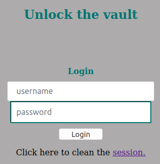

Introduzimos, então, ```admin'--``` no _username_ (e um lixo qualquer no campo _password_, pois não podemos deixá-lo vazio). A pelica faz com que o campo ```$username``` conclua a _query_ e os dois hífenes tornam o resto da _query_ em comentário, deixando-o sem efeito.

Voilà! Conseguimos, assim, iniciar sessão e é-nos apresentada a _flag_:

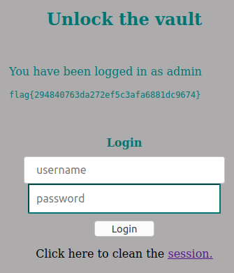
